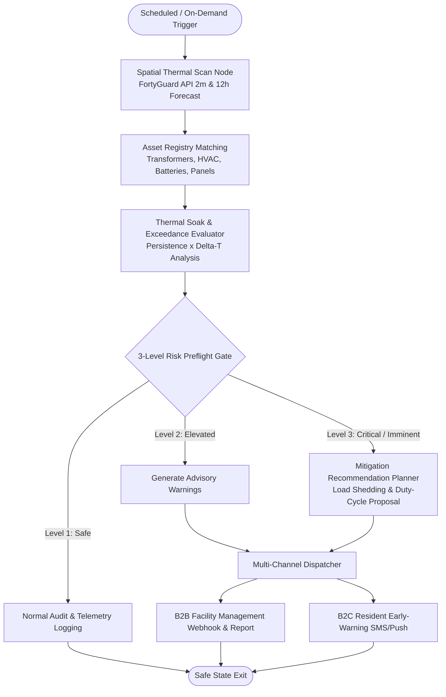

# 🧠 Master Context Reservoir - FortyGuard Hackathon'26

> **Project:** Thermal Sentinel Grid (formerly PyreShield AI ideation base)  
> **Author:** Karim Y. Azab (Karim Yasser)  
> **Target Event:** FortyGuard Hackathon'26 - *Building the World's Temperature AI* (Aug 18-30, 2026)  
> **Repository Path:** `/Users/karim/Development/projects/fortyguard-hackathon`

---

## 📖 How to Use This Document
This document is the **single source of truth and context reservoir** for any future AI assistant, collaborator, or conversation regarding this hackathon project. It preserves:
1. The **primary project vision (Thermal Sentinel Grid)** with IEEE/IEC physics, Control Barrier Functions, and 4 asymmetric moats.
2. The **real-world problem context and local hazard inspiration** (Egypt / Middle East / US Sunbelt).
3. The **complete draft catalog of alternative brainstormed ideas** so no design thought is lost.
4. The **FortyGuard API technical mechanics, challenge tracks, mentor advice, and judging strategies**.
5. The **developer's engineering background and research credentials**.

---

# SECTION 1: PRIMARY PROJECT VISION - Thermal Sentinel Grid

*For the complete specifications, see **[Thermal Sentinel Grid Specification](docs/research/THERMAL_SENTINEL_GRID_SPECIFICATION.md)** and **[Asymmetric Innovation & Physical Mechanisms](docs/research/ASYMMETRIC_INNOVATION_AND_PHYSICAL_MECHANISMS.md)**.*

## 1.1 The Core Problem & The Physics of 2-Meter Heat
Standard weather services (e.g., Apple Weather, OpenWeather, NOAA) measure ambient air at airport stations or 10-30 meters above the ground, while satellites only measure orbital Land Surface Temperature (LST). These sources report a generic macroscopic temperature (e.g., 38°C-40°C).

However, **critical urban and building electrical infrastructure sits in the 2-meter boundary layer above asphalt and concrete**:
- **Outdoor AC compressor units** (ground-mounted or on lower-floor balconies at 1-2m).
- **Street-level electrical distribution boxes, transformers, and building junction meters** (1-2m above sidewalks).
- **Rooftop solar inverters, balcony lithium battery storage, and EV charging stations** (0-2m).

In dense urban environments, unshaded asphalt radiates intense convective and radiative heat. While a weather app reports a manageable 38°C, the relevant ambient air **2 meters above the ground** can remain dangerously hot for hours. The pinned downtown Phoenix capture peaks at **42.74°C** and stays above **40°C for all 12 sampled hours**.

### The Failure Mechanism (Thermal Soak -> Thermal Runaway):
- Standard electrical components (capacitors, breakers, inverters, lithium battery cells) are rated for safe continuous operation up to **40°C-45°C ambient**.
- Devices do not explode from a brief 5-minute temperature spike. Disasters occur due to **cumulative thermal soak** (sitting in 48°C+ air for 4-6 consecutive hours).
- Electrolytic capacitors boil and vent violently, refrigerant lines over-pressurize, and lithium-ion cells enter irreversible thermal runaway - causing massive electrical arc explosions and structural fires.

## 1.2 The Real-World Local Hazard (Egypt Origin Story)
In Egypt and across the MENA region, recent unprecedented summer heatwaves triggered a documented public safety crisis: a massive surge in **residential and commercial building fires, AC compressor bursts, and transformer explosions**. 

Residents and facility managers had zero warning because regional weather forecasts did not reflect the extreme thermal microclimate enveloping their building facades and electrical closets. This is not a theoretical scenario; it is an urgent, life-threatening urban hazard that also heavily impacts US Sunbelt cities (Phoenix, Las Vegas, Texas).

## 1.3 Why FortyGuard's Temperature AI is the Essential Solution
FortyGuard provides 4 proprietary capabilities that directly solve this blind spot:
1. **2-Meter Ground-Level Air Temperature:** Captures the exact air envelope where equipment sits (20m spatial resolution).
2. **Thermal Persistence Layer:** Quantifies cumulative continuous hours spent above critical safety thresholds (measuring thermal soak).
3. **Exceedance Layer:** Directly calculates degree deltas above equipment maximum ratings (e.g., exceeding 40°C or 45°C).
4. **12-Hour Hyperlocal Forecast:** Allows the agent to predict explosion windows half a day before the peak heatwave hits.

## 1.4 Dual-Market Business Model (B2B + B2C)

### A. B2B Enterprise (Facility Managers, EPC Firms, Property Insurers, Utilities)
- **High ROI / Pain Point:** Property insurers pay billions in fire claims caused by electrical failure during heatwaves. Data centers and commercial facilities face millions in downtime when outdoor chillers and transformers trip.
- **Agent Deliverable:** Automated thermal audits, predictive equipment derating schedules, proactive HVAC pre-cooling cycles, and automated load-shedding dispatch to prevent catastrophic blowouts.

### B. B2C Consumer (Homeowners, Tenants, Small Businesses)
- **Pain Point:** Lack of visibility into whether their specific balcony or unshaded facade is entering an explosive thermal trap.
- **Agent Deliverable:** Real-time push alerts ("Your facade will hit 49°C persistence between 1 PM-4 PM: run AC on moderate eco-cycle and avoid simultaneous high-draw appliances to prevent circuit breaker fires").

## 1.5 Why Physics-Constrained Agentic AI (Track 06) Over Black-Box ML Training
*(For the full deep-dive, see **[Value Proposition & AI Philosophy](docs/research/VALUE_PROPOSITION_AND_AI_PHILOSOPHY.md)**)*
- **FortyGuard Already Solved Microclimate ML:** 2m convective air, land-cover morphology, and 12h forecasts are directly provided by FortyGuard's AI.
- **Use Standards-Based Physical ODEs:** Transformer heat rise and Arrhenius cellulose degradation can be represented with IEEE Std C57.91 / IEC 60076-7 models. The prototype favors transparent first-principles calculations over an unvalidated black-box surrogate; operational use still requires asset-specific calibration.
- **Mission-Critical Safety Demands Deterministic Validation:** A black-box LLM must not directly control breakers or BESS. The prototype evaluates proposed actions against bounded thermal, voltage, reserve, and state-of-charge trajectories.
- **The 4-Layer Stack:** Perception (FortyGuard AI) $\to$ Physical Model (IEEE-based ODEs) $\to$ Agentic Planner (LangGraph StateGraph) $\to$ Deterministic Safety Envelope.

---

# SECTION 2: TECHNICAL ARCHITECTURE & AGENT PIPELINE

## 2.1 LangGraph StateGraph Architecture

## 2.2 Core Modules Implemented in `src/`

1. **`src/api/fortyguard_client.py`:**
 - Asynchronous submit-and-poll client for FortyGuard API.
 - Endpoints: Snapshot, Exceedance, Persistence, 12h Forecast.
 - Rate limiting, error handling, token credit management.

2. **`src/models/asset.py`:**
 - Pydantic models for physical assets:
 - `AssetType`: `HVAC_COMPRESSOR`, `TRANSFORMER_BOX`, `SOLAR_INVERTER`, `BATTERY_STORAGE`, `EV_CHARGER`, `ELECTRICAL_PANEL`.
 - `MountingLocation`: `GROUND_LEVEL` (0-1m), `STREET_INTERFACE` (1-2m), `BALCONY_FACADE` (2-5m), `ROOFTOP`.
 - `ThermalLimits`: `max_safe_ambient_temp_c` (e.g. 40°C), `critical_explosion_temp_c` (e.g. 50°C).

3. **`src/agent/graph.py`:**
 - Deterministic LangGraph StateGraph.
 - Physical-envelope constraint layer clamping LLM reasoning to physical thermodynamics.
 - Formal failure routing and self-correction loops.

4. **`src/operations/portfolio.py`:**
 - Deterministic asset triage normalized over available evidence.
 - Explicit wet-bulb/2m-air worker intervention screening with no WBGT certification claim.
 - Content-addressed SHA-256 evidence snapshots shared by REST and MCP-compatible tools.

5. **`src/server/main.py` and `src/server/routes/`:**
 - FastAPI server exposing live scan, asset registry, deterministic replay, sandbox, analytics, persistence, portfolio operations, and MCP-compatible endpoints.
 - Current operations routes: `GET/POST /api/v1/operations/portfolio` and `GET/POST /api/v1/mcp`.

---

# SECTION 3: DRAFT RESERVOIR - ALTERNATIVE IDEAS CATALOG

*(Preserved so that any concept can be adapted, merged, or referenced during the hackathon)*

---

### 💡 Draft Idea 1: Autonomous Cold-Chain & Last-Mile Thermal Risk Dispatch
- **Tracks:** Track 03 (Industrial & Enterprise) + Track 06 (Agentic AI)
- **Problem:** Refrigerated delivery vans (carrying pharmaceuticals, vaccines, dairy/meat) and EV delivery fleets lose massive cooling efficiency when trapped in 2m asphalt heat corridors (surface temps 50°C+). Refrigeration units draw 40% more battery/fuel, causing cargo spoilage and battery thermal throttling.
- **Solution:** A LangGraph agent integrating fleet telematics with FortyGuard's 2-meter persistence & exceedance layers to dynamically calculate **heat-minimized delivery routes**, schedule proactive cargo pre-cooling prior to entering heat corridors, and alert drivers to avoid persistent thermal choke points.
- **Target Customers:** Cold-chain logistics (DHL, FedEx, UPS), grocery fleets, pharma distributors, commercial cargo insurers.

---

### 💡 Draft Idea 2: Predictive Data Center & Power Grid Thermal Peak Shaver
- **Tracks:** Track 02 (Future Buildings & Energy) + Track 03 (Industrial & Enterprise)
- **Problem:** Urban data centers and electrical substations reject immense heat into the immediate surrounding street air. When ambient temperature 2m above ground exceeds 42°C, chiller coefficient of performance (COP) drops by 20-30%, spiking electricity bills with massive peak-demand utility penalties.
- **Solution:** An autonomous HVAC & workload dispatch agent using FortyGuard's 12-hour thermal forecast and persistence layers. It dynamically schedules predictive pre-cooling (ice/thermal storage) during cooler nighttime/morning hours and shifts compute workloads across distributed edge nodes away from localized street-level thermal spikes.
- **Target Customers:** Hyperscale / colocation data centers (Equinix, Digital Realty), industrial facility managers, power utilities.

---

### 💡 Draft Idea 3: OSHA-Compliance & Construction Site Thermal Risk Agent
- **Tracks:** Track 03 (Industrial & Enterprise) + Track 04 (Government & Environment)
- **Problem:** On construction and EPC infrastructure sites, pouring concrete and operating heavy machinery during extreme heat causes micro-cracking, curing failure ($100k+ rework), and dangerous worker heat exhaustion (triggering strict OSHA compliance fines and liability lawsuits).
- **Solution:** An autonomous site-safety agent monitoring FortyGuard's street-level API for active job sites, automatically generating auditable OSHA compliance logs, predicting safe concrete pouring windows, and dispatching automated SMS rest-cycle alerts.
- **Target Customers:** General contractors, EPC firms (Bechtel, CCC, Arabtec), construction insurers.

---

### 💡 Draft Idea 4: Dynamic Pedestrian / Delivery Cool-Corridor Router
- **Tracks:** Track 01 (Resilient Cities & Infrastructure) + Track 06 (Agentic AI)
- **Problem:** Walking or cycling through cities during heatwaves exposes couriers and pedestrians to dangerous thermal stress, but navigation apps only optimize for shortest distance or vehicle traffic.
- **Solution:** A microclimate routing engine that maps FortyGuard's 2m street temperature and shade cover to compute "cool corridors" - minimizing thermal exposure for outdoor commuters and delivery couriers.
- **Target Customers:** Municipal city apps, urban planners, micro-mobility operators.

---

# SECTION 4: HACKATHON RULES, TRACKS & JUDGING STRATEGY

## 4.1 Key Event Facts
- **Dates:** August 18 - 30, 2026 (GST / UTC+4). Hard submission deadline: August 30, 2026 at 23:59 GST.
- **Format:** Global, fully online. Free registration, free dashboard access, trial API credits provided.
- **Geographic Scope of FortyGuard Data:** Covers United States urban locations (historical data from Jan 1, 2021 to present; 12-hour forward forecast).
- **Prizes:** $6,000 Total Cash Pool ($3,000 1st place, $2,000 2nd place, $1,000 3rd place) + **NVIDIA Jetson AI Developer Kit** hardware prizes + FortyGuard internship/incubation pathways.

## 4.2 Official Judging Criteria (100% Total)
1. **Impact & Relevance (40%):** Does the project solve a real, painfully felt problem? Would an actual paying client or municipality adopt and rely on it?
2. **Technical Execution (35%):** Quality of architecture, effective implementation of FortyGuard API (async submit/poll, analysis layers), robustness of agent workflow.
3. **Innovation (15%):** Novelty, creative angle, and uniqueness of approach.
4. **Communication & Presentation (10%):** Quality of demo video (2-5 min), clear documentation, and concise repository README.

## 4.3 Key Mentor & Session Insights (Full Dialogues in `docs/sessions-dialogue/`)

*For the complete implementation specification, see **[Thermal Sentinel Grid Specification](docs/research/THERMAL_SENTINEL_GRID_SPECIFICATION.md)**. For the 4 asymmetric innovation mechanisms, see **[Asymmetric Innovation & Physical Mechanisms](docs/research/ASYMMETRIC_INNOVATION_AND_PHYSICAL_MECHANISMS.md)**. For the financial model and pitch script, see **[Economic Model, UI Architecture & Pitch Script](docs/research/ECONOMIC_MODEL_DASHBOARD_AND_PITCH_SCRIPT.md)**. For the comprehensive playbook and idea selection framework, see **[Mentor Insights & Idea Selection Framework](docs/research/MENTOR_INSIGHTS_AND_IDEA_FRAMEWORK.md)**. For the rigorous physical models and IEEE/UL standards synthesis, see **[Physical-AI Research & Standards Synthesis](docs/research/RESEARCH_AGENT_SYNTHESIS_AND_PHYSICAL_MODELS.md)**. For individual transcripts, see **[docs/sessions-dialogue/](docs/sessions-dialogue/README.md)**:*

1. **[01. Onboarding & Kickoff Session](docs/sessions-dialogue/1-onboarding-kickoff-session.md):**

 - *Speakers:* Jay (Founder & CEO) & Nahil (Community Lead).
 - *Guidelines:* Sprint period August 18-30 (deadline Aug 30 11:59 PM GST). $6,000 cash pool + NVIDIA Jetson AI Developer Kits. Mandatory deliverables: working live URL, 3-minute video pitch, public repo with `Hackathon FG` added as collaborator. US data coverage at 2m resolution with 12h forecast and historical back to 2021.

2. **[02. Building on FortyGuard Temperature API®](docs/sessions-dialogue/2-building-fortyguard-temperature-api.md):**
 - *Speaker:* Fawad Shah (Head of Software Engineering at FortyGuard).
 - *Technical Guidance:* API queries for bounding boxes/polygons are compute-heavy and follow an **asynchronous submit-and-poll lifecycle** (poll every 3-5 seconds). 6 key endpoints: Heat Map, Parcel Analytics, Time-Series / Historical, Forecast, Exceedance, and Environmental Parameters. Essential for Agentic AI (Track 06) tool-calling architectures.

3. **[03. Heat Intelligence Cloud: What You Can Build](docs/sessions-dialogue/3-heat-cloud-webinar-session.md):**
 - *Speaker:* FortyGuard Lead Solutions Architect / AI ML Team.
 - *Architecture Guidance:* 4 core data layers: *Surface Temperature* (2m microclimate), *Thermal Comfort Analysis* (UTCI / Apparent Temp), *Air Quality* (AQI, PM2.5), and *Land Cover* (Canopy/Facade). Showcased 6 production demo products across PropTech, InsurTech, Logistics, Worker Safety, Urban Planning, and Utility Peak Load.

4. **[04. Breaking Silos with Autodesk: Data to Design](docs/sessions-dialogue/4-autodesk-webinar-session.md):**
 - *Speakers:* Jordana Rosa (Senior Technical Specialist, Autodesk Forma · 4x Hackathon Winner) & Jay (CEO).
 - *Mentorship Guidance:* Bringing FortyGuard 2m microclimate data into AEC design tools (Autodesk Forma, Revit, Civil 3D) for early-stage thermal performance modeling before breaking ground. Key winning strategies: team trust, leadership, rapid iteration, and pitching measurable real-world outcomes.

5. **[05. Escaping the Builder's Trap: Building MLPs with Google Cloud](docs/sessions-dialogue/5-builders-trap-webinar-session.md):**
 - *Speaker:* Ahmed Abdelkhalek (Head of Startups, Google Cloud & Hackathon Judge).
 - *Keynote:* Avoid over-engineering toy chat agents. Start with a painfully felt, high-cost problem; ensure clear GTM, 15-min pre-build checklist (Hero, Pain, AI Justification, Kill Switch), and paying customer demand.

6. **[06. Headlines to Impact: Mastering PR & Storytelling](docs/sessions-dialogue/6-headlines-to-impact-session.md):**
 - *Speaker:* Tarek (Founder & CEO, Narrative One).
 - *Keynote:* The 3 P's Engine (Perception → Presence → Partnerships), 80/20 headline rule, and leading with mission-driven *Why* in 3-minute video pitches.

7. **[07. From Heat Data to Real Signal: Data Correlation Analysis](docs/sessions-dialogue/7-data-correlation-webinar-session.md):**
 - *Speakers:* Mudethir (Machine Learning Lead) & Aamir (Cloud/Data Architect, FortyGuard).
 - *Keynote:* Space-time-variable resolution (Where, When, What), preventing false/spurious correlations, 2m air temp vs LST/ERA5, "Fact vs. Finding" doctrine, and multi-rate data coupling (cadence matching).

8. **[08. Finding Product-Market Fit: Validating Idea, Customer, and Message](docs/sessions-dialogue/8-product-market-fit-webinar.md):**
 - *Speaker:* Thamir (Partner @ Cultivators; early operator at BreezoMeter through Google acquisition; Google Solar API validation lead).
 - *Keynote:* Transforming environmental API data into enterprise SaaS via asset protection, COCO Discovery framework (Context, Outcomes, Constraints, Options), Early Adopters vs Enterprise ICP, and the Space Pen vs Pencil rule.

9. **Karol Wiszowaty (Inspeerity COO):**
 - *Keynote: "Why Great Ideas Die on the Whiteboard (and How to Save Yours)."*
 - *Lesson:* Sell the **outcome**, not the tech stack. Judges care about tangible results and risk reduction.

10. **Prof. Jonathan Reichental (Founder Human Future, former Palo Alto CIO):**
 - *Keynote: "Physical AI in Local Government & Smart Cities."*
 - *Lesson:* Practical physical AI bridging sensor/environmental data with municipal and infrastructure resilience.

## 4.4 The 7 Official Tracks
1. **Track 01: Resilient Cities & Infrastructure** (Cool Route Planner, Asset Heat Audit, Digital Twins).
2. **Track 02: Future Buildings & Energy** (HVAC Optimization, Energy Forecasting, Thermal Stress).
3. **Track 03: Industrial & Enterprise** (Logistics Heat Risk, Data Center Cooling, Worker Safety).
4. **Track 04: Government & Environment** (Heat Vulnerability Maps, Environmental Planning).
5. **Track 05: Model Designing** (Forecasting Engines, Anomaly Detectors, Risk Classifiers).
6. **Track 06: Agentic AI** (Autonomous Agents, API Tool Orchestration, Workflow Automation).
7. **Track 07: Data Analysis & Correlation** (Heat Equity, Economic Impact, Productivity Studies).

---

# SECTION 5: AUTHOR BACKGROUND & TECHNICAL CAPABILITIES

- **Developer:** Karim Y. Azab (Karim Yasser)
- **Degree:** Bachelor of Engineering in Computer Engineering, Cairo University Faculty of Engineering (GPA: 3.84, Expected Jun 2027).
- **Key Experience & Credentials:**
 - **AI Research Intern @ Nile University (SESC Research Center):** Architected an autonomous Multi-Agent AI Pipeline and 19-tool MCP harness translating natural language into verified OpenFOAM CFD/thermal cases. Built deterministic C++ renderers, 3-level preflight gates, thermodynamic envelope constraints, and MPI validation ladders. **Supervisor publishing research paper as co-authors.**
 - **Software Engineer Intern @ Siemens EDA (Solido Design Environment):** Re-architected Commit-Based Analysis Tool (CAT) RTS platform, slashing runtime from 23.6h to 26min (~54.5x speedup) on 21 GB coverage corpus with SQLite covering indexes, worker pools, and persistent AST caches.
 - **Hackathon Track Record:** 1st place in 30+ team i'Supply Hackathon; 1st place in ODC x INSTANT AI Hackathon (3D BraTS medical segmentation).
- **Core Stack:** Python 3.13, FastAPI, LangGraph, NumPy, pandas, React 19, TypeScript, Vite, Tailwind CSS v4, Apache ECharts, Docker.

---

# SECTION 6: IMPLEMENTATION STATUS & PRODUCTION CAPABILITIES

## 6.1 Core Tested Architecture (168 passed, 3 opt-in live tests skipped by default)
* **FortyGuard Async Client (`src/api/fortyguard_client.py`):** Submit-and-poll lifecycle, 404 retry resilience, durable request caching, and explicit fixture replay paths. Live scan failures surface as errors rather than silently switching locations.
* **IEEE Differential Thermal Engine (`src/physics/transformer_thermal.py`):** Exact discrete-time exponential updates for top-oil ($\theta_o$) and hot-spot ($\theta_w$) temperatures with Arrhenius aging integration.
* **4 Asymmetric Physical Moats:**
  1. *IEC 60287 Cable-Soil Moisture Dryout (`src/physics/soil_cable.py`)*
  2. *CBF-Inspired Deterministic Safety Envelope (`src/safety/cbf_gate.py`)*
  3. *Urban Canyon Aerodynamic Throttling (`src/physics/urban_canyon.py`)*
  4. *Virtual Paper-to-Oil Moisture Desorption (`src/physics/virtual_moisture.py`)*
* **Scenario Economic Engine (`src/physics/economic_model.py`):** VoLL-informed, assumption-based avoided-exposure and cost-ratio calculations. Outputs are not realized savings or actuarially calibrated forecasts.
* **IEEE Std C57.91-2011 Annex G Benchmark Engine (`src/physics/ieee_annex_g_benchmark.py`):** Verified against Clause G.2 (Step Load) & Clause G.3 (Diurnal Ambient Ramp) with $<0.0001^\circ\mathrm{C}$ error.
* **72-Hour Multi-Day Compounding Simulation (`src/physics/multi_day_heatwave.py`):** Frozen live FortyGuard boundaries for every hour of July 24–26, 2023, with modelled continuous overnight heat soak and soil dryout (end-of-day $\rho_{\text{soil}} = 1.52 \to 2.13 \to 2.41\text{ K}\cdot\text{m/W}$).
* **AC Distribution Feeder Power Flow Engine (`src/physics/power_flow.py`):** 4-Bus radial grid solver with On-Load Tap Changer (OLTC $\pm 10\%$) and 4-quadrant BESS Volt/VAR support under ANSI C84.1 Range A envelope.
* **4 Advanced Mathematical Moats:**
  1. *Dynamic Line Rating (IEEE Std 738-2012) & Conductor Sag (`src/physics/dynamic_line_rating.py`)*
  2. *Coupled Electro-Thermal BESS Degradation & SEI Kinetics (`src/physics/bess_electro_thermal.py`)*
  3. *Arrhenius-Weibull Grid Fragility & Cascading Outage Risk (`src/physics/weibull_hazard.py`)*
  4. *Analytical Uncertainty-Bounded Dispatch Screen (`src/physics/chance_constrained_opf.py`)*
* **LangGraph Multi-Agent Workflow (`src/agent/graph.py`):** Deterministic state graph (`forecast_node` $\to$ `physics_node` $\to$ `planner_node` $\to$ `safety_gate_node` $\to$ `audit_dispatch_node`).
* **Portfolio Operations (`src/operations/portfolio.py`):** Read-only deterministic fleet triage, explicit wet-bulb/2m-air intervention screening, evidence-coverage reporting, and SHA-256 mitigation evidence. The same service is available through REST and an MCP-compatible JSON-RPC tool subset. The current view applies one common Phoenix stress profile and does not claim per-asset measurement or occupational-safety certification.
* **Independent Ground-Truth Validation (`src/api/iem_ground_truth_client.py`, `src/api/ground_truth_client.py`, `src/api/nsrdb_ground_truth_client.py`):** Cache-first IEM/ASOS physical-station validation, Open-Meteo gridded fallback, optional NSRDB solar benchmark, exact UTC-hour metrics, frozen Phoenix multi-station replay, explicit representativeness limits, and zero-credit replay provenance. FortyGuard's Phoenix local request hours retain an explicit MST offset (UTC−07:00) and are canonicalized to UTC before station joins. Positive $\Delta T$ is an urban–station anomaly—not causal UHI proof—unless a defensible same-time urban/rural reference design is supplied.
* **Operator Dashboard (14-Tab React 19 / TypeScript / Apache ECharts):**
  1. 🎬 Executive Pitch & Video Showcase (Home launchpad with video + interactive slide deck)
  2. ⚡ Mission Control Overview (12h synchronized replay scrubber & 3-axis telemetry)
  3. 🧭 Portfolio Operations (Fleet ranking, worker screen, evidence export, MCP invocation)
  4. 🎛️ Live What-If Stress Studio (6 interactive sliders with sub-15ms live physics re-solving)
  5. 🔥 72-Hour Compounding Heatwave Viewer (Continuous 3-day thermal accumulation)
  6. ⚡ AC Distribution Power Flow & Single-Line Diagram (DLR ampacity + Volt/VAR control)
  7. 🏆 IEEE Annex G Standard Benchmark Suite (Clause G.2 & G.3 numerical proof)
  8. 🌡️ Independent Ground Truth (PHX ASOS comparison, aligned errors, correlation, and persistence)
  9. 📚 Academic Provenance & alphaXiv Corpus (22 indexed papers with LaTeX proofs)
  10. 🗺️ Hyperlocal 2m GIS Viewer (60m urban parcel microclimate tiles)
  11. 🛡️ Scientific Moats Deep-Dive (Physical equations & barrier invariance)
  12. 🤖 LangGraph Multi-Agent Engine Visualizer (StateGraph execution & audit ledger)
  13. 💰 Scenario Economic Audit (VoLL-informed assumptions; not realized savings)
  14. 📊 Data Science Studio (ETL, empirical correlations, ML surrogate, anomaly and RUL analysis)

