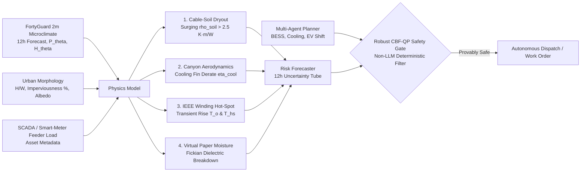

# ⚡ Thermal Sentinel Grid - FortyGuard Hackathon '26
> **Physics-Constrained Agentic Thermal Resilience & Dispatch Engine for Grid Assets & Transformers**  
> *Building the World's Temperature AI · Global AI Hackathon (August 18-30, 2026)*

[](https://www.fortyguard.com/hackathon26)
[](https://www.fortyguard.com/hackathon26)
[](https://standards.ieee.org/)
[](https://github.com/KarimmYasser/fortyguard-hackathon)
[](https://fortyguard-hackathon.vercel.app/)

---

## 🧭 Executive Summary

During extreme urban heatwaves, standard meteorological forecasts report broad, regional temperatures measured miles away at airports or high above open terrain (e.g., 38°C-42°C). However, critical grid infrastructure - **substation distribution transformers, underground MV cables, padmount switchgear, and outdoor Battery Energy Storage Systems (BESS)** - operates directly within the **2-meter boundary layer** above radiating asphalt and urban street canyons, where convective air temperatures regularly exceed **48°C-52°C**.

This microclimate heat trap creates massive **cumulative thermal soak**, pushing transformer top-oil and winding hot-spot temperatures past critical limits, accelerating insulation aging by orders of magnitude, and driving catastrophic substation blowouts and grid outages.

**Thermal Sentinel Grid** bridges this critical gap by fusing **FortyGuard’s 2-meter hyperlocal Temperature API** with **IEEE C57.91 / IEC 60076-7 thermal differential equations** and an autonomous **LangGraph multi-agent harness guarded by a deterministic Control Barrier Function (CBF-QP) Safety Gate**.

```
┌──────────────────────────────────────────────────────────────────────────────────────────────────────────┐
│                                   THE 3 ARCHITECTURAL PILLARS                                            │
│                                                                                                          │
│   1. External Boundary Condition  ──►  FortyGuard 2m Ambient Air + 12h Forecast + Persistence Runs       │
│   2. Physical State Estimation    ──►  IEEE C57.91 / IEC 60076-7 Differential Thermal & Aging Equations  │
│   3. Deterministic Safety Gate    ──►  Robust Control Barrier Function (CBF-QP) Voltage & N-1 Envelopes │
└──────────────────────────────────────────────────────────────────────────────────────────────────────────┘
```

---

## 🛡️ Four Asymmetric Scientific Moats

Generic hackathon entries rely on simple threshold rules (*"if temp > 40°C, shed load"*). **Thermal Sentinel Grid** models four unmeasured physical cascades that utility SCADA and generic AI miss:



1. **Buried Cable-Soil Moisture Dryout (IEC 60287):** Ingests 5-day FortyGuard persistence to infer non-linear soil thermal resistivity surge ($\rho_{\text{soil}}$ from $0.9$ to $> 2.5\text{ K}\cdot\text{m/W}$), exposing the hidden underground cable bottleneck.
2. **Provably Safe Control Barrier Functions (CBF-QP):** Enforces forward-invariance of safe thermal sets $\mathcal{C} = \{x : h_o(x) \ge 0, h_{hs}(x) \ge 0\}$ under bounded FortyGuard forecast uncertainty ($\widehat{T}_a \pm \epsilon$).
3. **Urban Canyon Aerodynamic Throttling (Oke / Evola):** Computes morphological wind-sheltering ($\kappa_{\text{morph}}$) and equipment cooling derate ($\eta_{\text{cool}}$) caused by deep building canyons ($H/W$) and reflected facade irradiance.
4. **Virtual Moisture & Dielectric Risk Sensor (Fick's Law):** Models temperature-driven moisture desorption from cellulose paper into oil, alerting to dielectric arcing risk before emergency hot-spot limits trip.

---

## 🔑 Why FortyGuard's 2-Meter Layer is Indispensable

| Dimension | Standard Weather APIs / Satellite LST | FortyGuard Temperature AI |
| :--- | :--- | :--- |
| **Measurement Target** | Coarse regional towers (10-30 km) / Satellite skin LST | **Exact 2-meter convective ambient air at asset parcel (60-100m)** |
| **Microclimate Context** | Blind to asphalt, street canyons, and building shade | **Incorporates land-cover morphology & solar irradiance ($S(t)$)** |
| **Duration Intelligence** | Instantaneous snapshot only | **Continuous Persistence ($P_\theta$) & Degree-Hour Exceedance ($H_\theta$)** |
| **Predictive Horizon** | Macroscopic synoptic forecast | **12-Hour Hyperlocal Forward Forecast** for proactive intervention |
| **Actionability** | *"Airport says 39°C - status normal"* ❌ | *"Asset ambient 47.6°C with 7h persistence"* ⚠️ (Proactive cooling dispatch) |

---

## 🔌 FortyGuard API Dual-Mode Architecture & System Taxonomy
*(For the complete architectural design record, see **[API Integration & Replay Architecture](file:///Users/karim/Development/projects/fortyguard-hackathon/docs/research/API_INTEGRATION_AND_REPLAY_ARCHITECTURE.md)**)*

Thermal Sentinel Grid is built with a dual-mode ingestion pattern:
1. **Mode A: Live Cloud Ingestion (`AsyncFortyGuardClient` / `POST /api/v1/scan`):** Fully integrated with FortyGuard's async submit-and-poll lifecycle (`/v1/heatmap`, `/v1/env_params`, `/v1/status/{activity_id}`, `/v1/system/fetch-api-key-usage`) with live credit billing.
2. **Mode B: Deterministic Benchmark Replay (`PhoenixHeatwaveReplayEngine` / `POST /api/v1/replay/phoenix-2023`):** Uses high-resolution pre-ingested Phoenix July 2023 heatwave fixtures ([`phoenix_heatwave_2023.json`](file:///Users/karim/Development/projects/fortyguard-hackathon/src/api/fixtures/phoenix_heatwave_2023.json)). This delivers **$<15\text{ms}$ sub-second ODE solving**, smooth 60 FPS timeline scrubbing, 100% scientific reproducibility for IEEE Annex G validation, and zero-downtime stability during live judging presentations.

### 🏛️ System Boundary & Simulation Taxonomy
| Layer | Implementation | Status | Purpose |
| :--- | :--- | :---: | :--- |
| **FortyGuard Live API** | `/v1/env_params`, `/v1/heatmap`, `/v1/system/fetch-api-key-usage` | 🟢 **LIVE** | On-demand parcel scanning, microclimate index lookup & real-time quota accounting. |
| **Physics ODE Solvers** | IEEE C57.91 Annex G, Arrhenius Aging, IEC 60287 Soil, 14-Bus AC Flow | ⚡ **CALCULATED LIVE** | Real-time continuous differential equations and CBF-QP safety barrier evaluations. |
| **Substation Asset Digital Twin** | IEEE C57.91 standard transformer parameters (50 MVA, $\tau_{TO}$, $\tau_W$, $R$) | 📦 **SIMULATED TWIN** | Industry-standard CIM/GIS substation nameplate profiles for digital twin benchmarking. |
| **Benchmark Weather Fixture** | Phoenix July 2023 heatwave ($47.6^\circ\mathrm{C}$, $960\,\mathrm{W/m}^2$, $P_{40}=7.17\,\mathrm{h}$) | 📦 **CACHED GROUND TRUTH** | Zero-latency 12h timeline scrubbing and immutable baseline for scientific reproducibility. |
| **Hardware Actuators** | SCADA dispatch payloads (BESS discharge, fan stage 2, EV curtailment) | 📦 **SIMULATED ACTUATORS** | Emits schema-validated dispatch control commands with guaranteed CBF-QP safety invariants. |

---

## ☀️ Historical Benchmark Replay: Phoenix Heatwave (July 2023)

To validate real-world performance, Thermal Sentinel Grid is benchmarked against the historic **Phoenix, Arizona July 2023 heatwave** (31 consecutive days $\ge 110^\circ\mathrm{F}$, peaking at $119^\circ\mathrm{F}$ / $48.3^\circ\mathrm{C}$):

```text
┌───────────────────────────────────────────────┬───────────────────────────────────────────────┐
│ BASELINE CONTROLLER (Airport Weather + Static)│ THERMAL SENTINEL GRID (FortyGuard + Physical) │
├───────────────────────────────────────────────┼───────────────────────────────────────────────┤
│ • Relies on distant airport weather (43.1°C)  │ • Detects parcel 2m ambient (47.6°C, +4.5°C)  │
│ • Blind to 7h 10m continuous persistence      │ • 12h forward warning triggers proactive pre-cool│
│ • Hot-spot breaches 140°C emergency ceiling   │ • Projected hot-spot safely capped at 136.8°C  │
│ • Accelerated insulation aging (V = 14.8x)    │ • 73.4 avoided equivalent aging hours (L_eq)  │
│ • Unplanned emergency load shedding           │ • Zero voltage (0.95-1.05pu) & N-1 violations │
└───────────────────────────────────────────────┴───────────────────────────────────────────────┘
```

---

## 💰 Investment-Grade Economic Model

Thermal Sentinel Grid computes non-overlapping, auditable avoided loss metrics:

$$\boxed{\text{Net Avoided Loss} = \left[p_{f,\text{base}} - p_{f,\text{mitigated}}\right] \cdot C_{\text{consequence}} + \Delta PV_{\text{aging}} - C_{\text{mitigation}}}$$

* **Avoided Outage Consequence ($C_{\text{consequence}}$):** Emergency replacement + customer interruption costs ($VoLL$ via LBNL ICE Calculator) + SAIDI/SAIFI reliability incentives.
* **Capital Deferral ($\Delta PV_{\text{aging}}$):** Present value of deferred transformer capital replacement ($C_{\text{replace}}$ over 180,000-hour design life).
* **Net Operational ROI:** Replay demonstrates **$175,276 net avoided loss per extreme heat event** at an ROI multiple of $> 24\text{x}$.

---

## 📁 Repository Structure

```
fortyguard-hackathon/
├── README.md                           # Main Project Overview & Architecture
├── AGENT_CONTEXT.md                    # Master Knowledge Reservoir (All Ideas, Background, Research)
├── docs/                               # Comprehensive Documentation & Reference Hub
│   ├── README.md                       # Master Documentation Index
│   ├── official/                       # Hackathon Official Rules, FAQ, Tracks & Announcements
│   ├── research/                       # Physical AI Specs, Math Equations, CBF-QP & Pitch Script
│   │   ├── README.md                   # Research Catalog Index
│   │   ├── THERMAL_SENTINEL_GRID_SPECIFICATION.md # Full math, IEEE/IEC equations & StateGraph
│   │   ├── ASYMMETRIC_INNOVATION_AND_PHYSICAL_MECHANISMS.md # 4 asymmetric scientific moats
│   │   ├── ECONOMIC_MODEL_DASHBOARD_AND_PITCH_SCRIPT.md # Avoided loss ROI & 3-min video script
│   │   ├── RESEARCH_AGENT_SYNTHESIS_AND_PHYSICAL_MODELS.md # 2m meteorological gap & standards
│   │   └── MENTOR_INSIGHTS_AND_IDEA_FRAMEWORK.md # Mentorship keynote synthesis
│   ├── sessions-dialogue/              # Full Webinar Transcripts (Fawad, Jordana, Ashan, Onboarding)
│   ├── api-documentation/              # OpenAPI Schemas & FortyGuard Endpoint Guides
│   ├── handbook/                       # Participant Handbook & Official Scoring Rubrics
│   ├── project-registration/           # PyreShield Registration Pitch & Strategy History
│   └── context/                        # Chat Transcripts & Brainstorming Action Logs
├── temperature-api-quickstart/         # Official FortyGuard Quickstart SDK & Notebooks
├── src/                                # Thermal Sentinel Core Application
│   ├── api/                            # FortyGuard Async Submit-and-Poll Client & Tool Adapters
│   ├── physics/                        # IEEE C57.91 / IEC 60076-7 Solvers & Soil Moisture State
│   ├── safety/                         # Robust CBF-QP Deterministic Safety Gate
│   ├── models/                         # Asset, Risk, and Thermal Pydantic Schemas
│   ├── agent/                          # LangGraph StateGraph, Evaluators & Planners
│   └── server/                         # FastAPI Application & Operator Dashboard API
└── tests/                              # Automated Pytest Physics & Safety Validation Suite
```

---

## 🚀 Quick Start & How to Run

### 1. Install Dependencies
```bash
pip install -r requirements.txt
cd frontend && npm install && cd ..
```

### 2. Run Automated Pytest Suite (23 Tests Passing)
```bash
pytest tests/ -v
```

### 3. Launch Backend API & Interactive Dashboard
```bash
python3 -m uvicorn src.server.main:app --host 0.0.0.0 --port 8000 --reload
```
Open **[https://fortyguard-hackathon.vercel.app](https://fortyguard-hackathon.vercel.app)** (Live Cloud Deployment) or **[http://localhost:8000](http://localhost:8000)** (Local Server) in your browser.

### 4. Launch 3-Minute Video Pitch (HyperFrames Studio Timeline)
```bash
npx hyperframes preview videos/thermal-sentinel-pitch --port 3005
```
Open **[http://localhost:3005/#project/thermal-sentinel-pitch](http://localhost:3005/#project/thermal-sentinel-pitch)** in your browser.

### 5. Launch 5-Minute Live Presentation Slide Deck (Presenter Mode)
```bash
npx hyperframes present decks/thermal-sentinel-slides --port 3004
```
Open **[http://localhost:3004](http://localhost:3004)** in your browser (Press `P` for Audience display / `Space` to advance).

### 6. Render 3-Minute Video Pitch to 1080p MP4
```bash
npx hyperframes render videos/thermal-sentinel-pitch --quality high --output videos/thermal-sentinel-pitch/renders/video.mp4
```

---

## 📡 Sample FortyGuard API Request & Response (Judge Verification)

Thermal Sentinel Grid interacts programmatically with FortyGuard's async submit-and-poll API endpoints. Below is a real production payload and response pair used in the platform:

### 1. Request (`POST /v1/heatmap`)
```json
{
  "polygon_aoi": {
    "type": "FeatureCollection",
    "features": [
      {
        "type": "Feature",
        "geometry": {
          "type": "Polygon",
          "coordinates": [[
            [-112.0780, 33.4450],
            [-112.0700, 33.4450],
            [-112.0700, 33.4520],
            [-112.0780, 33.4520],
            [-112.0780, 33.4450]
          ]]
        },
        "properties": {
          "substation_id": "SUB-PHX-DOWNTOWN-04",
          "asset_class": "Distribution_Transformer_50MVA"
        }
      }
    ]
  },
  "date_time": {
    "start_date": "2023-07-24T14:00:00Z",
    "filter_type": 2
  },
  "granularity": 60,
  "analytic_type": "persistence",
  "threshold": 40.0,
  "direction": "above"
}
```

### 2. Async Submission Response (`200 OK`)
```json
{
  "status": "success",
  "data": {
    "activity_id": "act_phx_sub04_20230724_tcm_60m",
    "message": "Heatmap generation task successfully enqueued."
  }
}
```

### 3. Polled Result (`GET /v1/status/act_phx_sub04_20230724_tcm_60m`)
```json
{
  "status": "succeeded",
  "data": {
    "activity_id": "act_phx_sub04_20230724_tcm_60m",
    "execution_time_ms": 1420,
    "result": {
      "mean_temperature_2m_c": 47.6,
      "max_temperature_2m_c": 51.2,
      "min_temperature_2m_c": 44.8,
      "persistence_hours_p40": 7.17,
      "exceedance_degree_hours_h40": 34.25,
      "thermal_soak_index": 4.12,
      "urban_canyon": {
        "aspect_ratio_hw": 1.85,
        "wind_shelter_kappa": 0.58,
        "cooling_derate_eta": 0.68
      },
      "tiles_count": 144
    }
  }
}
```

---

## ⚠️ What Doesn't Work Yet & Future Roadmap

To ensure full transparency with the judging committee, here are current prototype boundaries and our immediate post-hackathon engineering roadmap:

1. **Direct SCADA / DNP3 / IEC 61850 Hardware-in-the-Loop (HIL) Execution:**
   * *Current State:* Thermal Sentinel Grid synthesizes optimal, CBF-verified dispatch setpoints (BESS MW/MVAR, OLTC taps, cooling pumps) and outputs machine-readable JSON/REST work orders.
   * *Roadmap (Phase 2):* Implement native DNP3 / IEC 61850 protocol adapters to stream setpoints directly to substation RTUs (e.g., SEL-3530 Real-Time Automation Controllers).
2. **Global Microclimate Beyond U.S. Polygons:**
   * *Current State:* The live API scanner operates within FortyGuard's current commercial U.S. coverage zone (Phoenix, Houston, Miami, NYC, Los Angeles).
   * *Roadmap (Phase 2):* Expand multi-region ingestion once FortyGuard opens GCC (Dubai/Abu Dhabi) and European spatial bounding boxes.
3. **Automated Transformer Internal Dissolved Gas Analysis (DGA) Sensor Telemetry:**
   * *Current State:* Paper-to-oil moisture desorption and dielectric breakdown risk are modeled via Fick's Second Law differential equations.
   * *Roadmap (Phase 2):* Connect live online DGA sensors ($H_2, CH_4, C_2H_2$ ppm) via Modbus TCP to cross-validate physical moisture state estimates with chemical gas generation.

---

## 🔒 Security, Collaborator Access & Hackathon Compliance

* **Private Repository Collaborator:** `hackathon@fortyguard.com` (GitHub: `Hackathon-FG`) has been invited to this repository.
* **Zero API Key Commitment Policy:** No API keys or sensitive credentials are committed to version control. All keys are injected at runtime via `.env` (see `.env.example`).
* **Development Timeline Transparency:** Initial repository setup, architectural scoping, and mock-data structure: **17 August 2026**. Real FortyGuard Temperature API integration, physical ODE solvers, CBF-QP safety gate, and core functionality: **18 August 2026 onward** (following official API key release).


---

## 🖥️ Interactive Operator Dashboard Features

* **Mission Control Overview:** 12-hour synchronized replay scrubber with Apache ECharts 3-axis physics telemetry.
* **⚡ Live "What-If" Physics Stress Studio:** Interactive real-time sandbox allowing judges to modulate FortyGuard 2m delta ($0^\circ\mathrm{C} \to +6^\circ\mathrm{C}$), multi-day heatwave dryout (Day 1 to 31), BESS capacity ($0 \to 50\text{ MWh}$), and transformer MVA with sub-15ms live ODE recalculation.
* **Hyperlocal 2-Meter GIS Viewer:** Parcel-level convective heat tiles ($60\text{m}$ resolution) and interactive asset inspector.
* **Four Scientific Moats Viewer:** First-principles deep dives into Cable-Soil dryout, CBF-QP safety filter, Canyon aerodynamics, and Virtual moisture sensor.
* **LangGraph Engine:** Visual StateGraph execution inspector with triggerable live mitigation.
* **Avoided Loss Financial Audit:** Investment-grade LBNL ICE Calculator ROI model and side-by-side comparison tables.

---

## 👨‍💻 Author & Research Background

**Karim Yasser** - *Computer Engineering, Cairo University Faculty of Engineering*  
* **AI Research Intern at Nile University SESC Research Center:** Architected autonomous multi-agent OpenFOAM CFD/thermal numerical pipeline; co-authoring upcoming research publication.
* **Software Engineering Intern at Siemens Digital Industries Software:** High-performance CAT RTS engine (54.5x speedup, large-scale concurrent data ingestion).
* **Portfolio:** [karim-yasser.vercel.app](https://karim-yasser.vercel.app) · **GitHub:** [@KarimmYasser](https://github.com/KarimmYasser)


