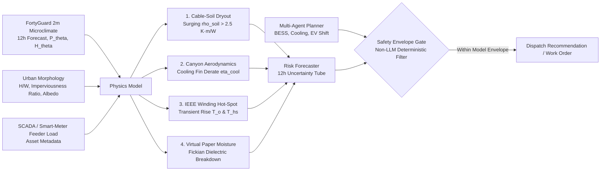

# ⚡ Thermal Sentinel Grid - FortyGuard Hackathon '26
> **Physical-AI Digital Twin & Autonomous Agentic Dispatch Engine for Grid Infrastructure & Distribution Transformers**  
> *Building the World's Temperature AI · Global AI Hackathon (August 18-30, 2026)*

[](https://www.fortyguard.com/hackathon26)
[](https://www.fortyguard.com/hackathon26)
[](https://www.fortyguard.com/hackathon26)
[](https://standards.ieee.org/)
[](https://github.com/KarimmYasser/fortyguard-hackathon)
[](LICENSE)
[](https://www.thermal-sentinel-grid.live/)
[](https://youtu.be/xfdOuxOmEgw)

---

## 🧭 Executive Summary: Delivering Wave 4 Physical AI

During extreme urban heatwaves, standard meteorological forecasts report broad regional conditions, while critical grid infrastructure—**substation distribution transformers, underground MV cables, padmount switchgear, and outdoor Battery Energy Storage Systems (BESS)**—operates inside the **2-meter boundary layer** above radiating asphalt and urban street canyons. In the pinned downtown Phoenix capture, FortyGuard measured a **42.74°C peak and 12 consecutive sampled hours above 40°C**. The operational signal is the sustained parcel-level boundary, not an assumed airport-to-city temperature gap.

This microclimate heat trap creates massive **cumulative thermal soak**, pushing transformer top-oil and winding hot-spot temperatures past critical limits, accelerating insulation aging by orders of magnitude, and driving catastrophic substation blowouts and grid outages.

**Thermal Sentinel Grid** bridges this critical gap by delivering **Wave 4 Physical AI**: fusing **FortyGuard’s 2-meter hyperlocal Temperature API** with **IEEE C57.91 / IEC 60076-7 thermal differential digital twins**, a **LangGraph multi-agent cognitive planner**, and a **deterministic, CBF-inspired safety-envelope filter**. It is a decision-support prototype: grid, asset, reliability, and economic outputs are modeled, no physical equipment is actuated, and operational deployment requires calibration and utility approval. See the [simulation scope and evidence contract](docs/SIMULATION_SCOPE_AND_ROADMAP.md).

```
┌──────────────────────────────────────────────────────────────────────────────────────────────────────────┐
│                             THE 4-LAYER PHYSICAL-AI DIGITAL TWIN ARCHITECTURE                            │
│                                                                                                          │
│   1. Perception AI (FortyGuard)   ──►  2m Ambient Air + 12h Hyperlocal Forecast + Continuous Persistence │
│   2. Physical Digital Twin        ──►  IEEE C57.91 Annex G Non-linear ODEs + IEC 60287 Soil Dryout       │
│   3. Agentic Cognitive Planner    ──►  LangGraph StateGraph Multi-Asset Policy Orchestrator (BESS/Fans)  │
│   4. Deterministic Safety Gate    ──►  Bounded-trajectory barrier filter checking ANSI C84.1 & N-1 limits│
└──────────────────────────────────────────────────────────────────────────────────────────────────────────┘
```

---

## 🪙 Multi-Stakeholder Value Translation: "Selling the Quarter-Inch Hole"
*(Informed by Karel Wiszowaty - Partner @ developX, ex-COO Inspirity - Session 11)*

```
┌───────────────────────────┬──────────────────────────────────┬────────────────────────────────────────────────────────────────────────┐
│ Stakeholder               │ Primary Currency / Priority      │ How Thermal Sentinel Grid Delivers Value                              │
├───────────────────────────┼──────────────────────────────────┼────────────────────────────────────────────────────────────────────────┤
│ Hackathon Judges (40% pts)│ Measurable Real-World Impact     │ ~$2.57M scenario avoided failure exposure & 365.4 aging hours saved.   │
├───────────────────────────┼──────────────────────────────────┼────────────────────────────────────────────────────────────────────────┤
│ Substation Reliability Eng│ Asset Life & IEEE Compliance     │ Enforces IEEE C57.91 140°C hot-spot ceiling & 12h BESS pre-cooling.    │
├───────────────────────────┼──────────────────────────────────┼────────────────────────────────────────────────────────────────────────┤
│ Utility Executives / CFO  │ Risk Mitigation & Opex Control   │ Prevents $2.8M transformer blowout replacements & regulatory outage fines│
├───────────────────────────┼──────────────────────────────────┼────────────────────────────────────────────────────────────────────────┤
│ Developers & Data Science │ Modularity, DX & Test Rigor      │ Medallion ETL (Bronze→Gold), 168 passing pytests, sub-15ms simulation. │
├───────────────────────────┼──────────────────────────────────┼────────────────────────────────────────────────────────────────────────┤
│ Venture Capitalists / VCs │ TAM Expansion & Defensible Moats │ Acute Painkiller riding FERC 881 tailwinds; compounding physical AI moat.│
└───────────────────────────┴──────────────────────────────────┴────────────────────────────────────────────────────────────────────────┘
```

---

## 🛡️ Four Asymmetric Scientific Moats

Generic hackathon entries rely on simple threshold rules (*"if temp > 40°C, shed load"*). **Thermal Sentinel Grid** models four unmeasured physical cascades that utility SCADA and generic AI miss:



### Core Substation & Microclimate Moats
1. **Buried Cable-Soil Moisture Dryout (IEC 60287):** Ingests 5-day FortyGuard persistence to infer non-linear soil thermal resistivity surge ($\rho_{\text{soil}}$ from $0.9$ to $> 2.5\text{ K}\cdot\text{m/W}$), exposing the hidden underground cable bottleneck.
2. **Deterministic CBF-Inspired Safety Filter:** Simulates bounded-uncertainty trajectories, checks thermal, voltage, BESS, and N-1 limits, and uses bisection to compute a safe maximum load. It is a prototype model check, not a field-certified QP controller.
3. **Urban Canyon Aerodynamic Throttling (Oke / Evola):** Computes morphological wind-sheltering ($\kappa_{\text{morph}}$) and equipment cooling derate ($\eta_{\text{cool}}$) caused by deep building canyons ($H/W$) and reflected facade irradiance.
4. **Virtual Moisture & Dielectric Risk Sensor (Fick's Law):** Models temperature-driven moisture desorption from cellulose paper into oil, alerting to dielectric arcing risk before emergency hot-spot limits trip.

### Advanced Grid Physics & Heavy Computational Moats
5. **Dynamic Line Rating & Catenary Sag (IEEE Std 738-2012):** Solves iterative Newton-Raphson convective, radiative, and solar heat equilibrium ($q_c + q_r = q_s + I^2R$) to unlock dynamic ampacity headroom (+22.5%) and prevent ground flashover sag ($S(T_c)$).
6. **BESS Coupled Electro-Thermal ODEs & Arrhenius SEI Capacity Fade:** Integrates 2-state lumped thermal differential equations ($T_{\mathrm{core}}$, $T_{\mathrm{surf}}$) with Arrhenius Solid Electrolyte Interphase (SEI) kinetics ($dQ_{\mathrm{loss}}/dt$), calculating real-time battery degradation cost (USD/MWh) and enforcing the $55^\circ\mathrm{C}$ thermal runaway safety ceiling.
7. **Arrhenius-Weibull Grid Fragility & Cascading Outage Risk:** Non-homogeneous Poisson-Weibull hazard model $\lambda_i(t, T)$ with Arrhenius acceleration $A_F(T)$ integrated across substation assets to compute joint cascading blackout probability ($P_{\mathrm{cascade}}$).
8. **Analytical Uncertainty-Bounded Dispatch Screen:** Applies Gaussian 90%/95%/99% quantiles to a simplified 4-bus feeder approximation, then selects BESS, OLTC, and shedding actions heuristically. This is not a numerical SOCP optimization solve.


---

## 🔑 Why FortyGuard's 2-Meter Layer is Indispensable

| Dimension | Standard Weather APIs / Satellite LST | FortyGuard Temperature AI |
| :--- | :--- | :--- |
| **Measurement Target** | Coarse regional towers (10-30 km) / Satellite skin LST | **Exact 2-meter convective ambient air at asset parcel (60-100m)** |
| **Microclimate Context** | Blind to asphalt, street canyons, and building shade | **Incorporates land-cover morphology & solar irradiance ($S(t)$)** |
| **Duration Intelligence** | Instantaneous snapshot only | **Continuous Persistence ($P_\theta$) & Degree-Hour Exceedance ($H_\theta$)** |
| **Predictive Horizon** | Macroscopic synoptic forecast | **12-Hour Hyperlocal Forward Forecast** for proactive intervention |
| **Actionability** | *"Regional forecast 42°C, static rating - status normal"* ❌ | *"Asset ambient 42.7°C sustained 12h above 40°C"* ⚠️ (Proactive cooling dispatch) |

---

## 🔌 FortyGuard API Dual-Mode Architecture & System Taxonomy
*(For the complete architectural design record, see **[API Integration & Replay Architecture](docs/research/API_INTEGRATION_AND_REPLAY_ARCHITECTURE.md)**)*

Thermal Sentinel Grid is built with a dual-mode ingestion pattern:
1. **Mode A: Live Cloud Ingestion (`AsyncFortyGuardClient` / `POST /api/v1/scan`):** Fully integrated with FortyGuard's async submit-and-poll lifecycle (`/v1/heatmap`, `/v1/env_params`, `/v1/status/{activity_id}`, `/v1/system/fetch-api-key-usage`) with live credit billing.
2. **Mode B: Deterministic Benchmark Replay (`PhoenixHeatwaveReplayEngine` / `GET /api/v1/replay/phoenix-2023`):** Uses high-resolution pre-ingested Phoenix July 2023 heatwave fixtures ([`phoenix_heatwave_2023.json`](src/api/fixtures/phoenix_heatwave_2023.json)). This delivers **$<15\text{ms}$ benchmark ODE solving**, smooth timeline scrubbing, deterministic replay for IEEE Annex G validation, and independence from live vendor calls during judging presentations.

### 🏛️ System Boundary & Simulation Taxonomy
| Layer | Implementation | Status | Purpose |
| :--- | :--- | :---: | :--- |
| **FortyGuard Live API** | `/v1/env_params`, `/v1/heatmap`, `/v1/system/fetch-api-key-usage` | 🟢 **LIVE** | On-demand parcel scanning, microclimate index lookup & real-time quota accounting. |
| **Physics & Grid Solvers** | IEEE C57.91, Arrhenius aging, IEC 60287 soil, 4-bus FBS power flow | ⚡ **CALCULATED LIVE** | Deterministic thermal trajectories, radial-feeder flow, and safety-envelope evaluations. |
| **Substation Asset Digital Twin** | IEEE C57.91 standard transformer parameters (50 MVA, $\tau_{TO}$, $\tau_W$, $R$) | 📦 **SIMULATED TWIN** | Industry-standard CIM/GIS substation nameplate profiles for digital twin benchmarking. |
| **Benchmark Weather Fixture** | Phoenix July 19, 2023 capture ($42.74^\circ\mathrm{C}$ peak, $889.8\,\mathrm{W/m}^2$ peak derived solar, $P_{40}=12.0\,\mathrm{h}$) | 📦 **FROZEN LIVE CAPTURE** | Zero-latency 12h timeline scrubbing and reproducible physics. |
| **Hardware Actuators** | Dispatch payloads (BESS discharge, fan stage 2, EV curtailment) | 📦 **SIMULATED ACTUATORS** | Emits schema-validated recommendations checked against the modelled safety envelope; no physical SCADA is connected. |

---

## ☀️ Historical Benchmark Replay: Phoenix Heatwave (July 2023)

To validate real-world performance, Thermal Sentinel Grid is benchmarked against the historic **Phoenix, Arizona July 2023 heatwave** (31 consecutive days $\ge 110^\circ\mathrm{F}$, peaking at $119^\circ\mathrm{F}$ / $48.3^\circ\mathrm{C}$):

```text
┌───────────────────────────────────────────────┬───────────────────────────────────────────────┐
│ BASELINE CONTROLLER (No proactive dispatch)  │ THERMAL SENTINEL GRID (FortyGuard + Physical) │
├───────────────────────────────────────────────┼───────────────────────────────────────────────┤
│ • No proactive response to the measured soak │ • Uses measured parcel 2m ambient (42.74°C)    │
│ • Blind to 12h continuous persistence         │ • Persistence triggers proactive pre-cooling   │
│ • Hot-spot reaches 159.53°C                   │ • Mitigated hot-spot held to 122.53°C          │
│ • 377.77 equivalent aging hours               │ • 365.4 equivalent aging hours avoided        │
│ • Unplanned emergency load shedding           │ • Zero voltage (0.95-1.05pu) & N-1 violations │
└───────────────────────────────────────────────┴───────────────────────────────────────────────┘
```

---

## 💰 Assumption-Based Scenario Economic Model

Thermal Sentinel Grid computes non-overlapping, auditable avoided loss metrics:

$$\boxed{\text{Net Avoided Loss} = \left[p_{f,\text{base}} - p_{f,\text{mitigated}}\right] \cdot C_{\text{consequence}} + \Delta PV_{\text{aging}} - C_{\text{mitigation}}}$$

* **Avoided Outage Consequence ($C_{\mathrm{consequence}}$):** Emergency replacement + customer interruption costs ($\mathrm{VoLL}$ via LBNL ICE Calculator) + SAIDI/SAIFI reliability incentives.
* **Capital Deferral ($\Delta PV_{\mathrm{aging}}$):** Present value of deferred transformer capital replacement ($C_{\mathrm{replace}}$ over 180,000-hour design life).
* **Scenario Economics:** The canonical replay currently estimates **\$2,566,192.66 avoided loss per event** at an assumption-based **5,472.6× ratio**, using \$2,565,951.22 avoided consequence exposure, \$710.44 capital-aging deferral, and \$469 mitigation cost. These are not realized savings or actuarially calibrated probabilities.

---

## 🏭 Portfolio Operations, Worker Screening & MCP Interface

*For the complete as-built contract, formulas, limitations, and examples, see **[Portfolio Operations, Worker Intervention Screening & MCP](docs/research/PORTFOLIO_OPERATIONS_AND_MCP.md)**.*

The operator dashboard extends the single-asset thermal replay into a portfolio decision surface:

1. **Portfolio risk ranking:** registered grid assets are ordered by a transparent deterministic triage score using the environmental boundary and whatever health, loading, and criticality evidence is actually available. Missing fields are excluded from score normalization rather than imputed.
2. **Worker intervention windows:** measured FortyGuard wet-bulb and 2 m air-temperature observations are screened against explicit thresholds to identify candidate field-work periods. This is an operational screen—not an OSHA/WBGT certification—because globe temperature, workload, clothing, and acclimatization are not measured.
3. **MCP-accessible tools:** `rank_portfolio_risk`, `find_worker_intervention_windows`, and `get_mitigation_evidence` expose the same deterministic implementation used by the web dashboard.
4. **Auditable evidence:** each decision snapshot carries a stable SHA-256 digest, environmental and asset provenance, calculation methods, thresholds, rankings, and limitations.

| Interface | Purpose |
| :--- | :--- |
| `GET /api/v1/operations/portfolio` | Default read-only portfolio ranking, worker screen, and evidence snapshot. |
| `POST /api/v1/operations/portfolio` | Repeat the screen with explicit air-temperature, wet-bulb, and minimum-duration thresholds. |
| `GET /api/v1/mcp` | Discover the deterministic MCP-compatible tool surface. |
| `POST /api/v1/mcp` | JSON-RPC `initialize`, `tools/list`, and `tools/call` operations. |


---

## 📁 Repository Structure

```
fortyguard-hackathon/
├── README.md                           # Main Project Overview & Architecture
├── AGENT_CONTEXT.md                    # Master Knowledge Reservoir (All Ideas, Background, Research)
├── docs/                               # Comprehensive Documentation & Reference Hub
│   ├── README.md                       # Master Documentation Index
│   ├── official/                       # Hackathon Official Rules, FAQ, Tracks & Announcements
│   ├── research/                       # Physical AI specs, equations & pitch script
│   │   ├── README.md                   # Research Catalog Index
│   │   ├── THERMAL_SENTINEL_GRID_SPECIFICATION.md # Full math, IEEE/IEC equations & StateGraph
│   │   ├── ASYMMETRIC_INNOVATION_AND_PHYSICAL_MECHANISMS.md # 4 asymmetric scientific moats
│   │   ├── ECONOMIC_MODEL_DASHBOARD_AND_PITCH_SCRIPT.md # Avoided loss ROI & 3-min video script
│   │   ├── RESEARCH_AGENT_SYNTHESIS_AND_PHYSICAL_MODELS.md # 2m meteorological gap & standards
│   │   └── MENTOR_INSIGHTS_AND_IDEA_FRAMEWORK.md # Mentorship keynote synthesis
│   ├── sessions-dialogue/              # Full Webinar Transcripts (Sessions 01-08: Fawad, Jordana, Ashan, Ahmed, Tarek, Mudethir, Thamir)
│   ├── api-documentation/              # OpenAPI Schemas & FortyGuard Endpoint Guides
│   ├── handbook/                       # Participant Handbook & Official Scoring Rubrics
│   ├── project-registration/           # PyreShield Registration Pitch & Strategy History
│   └── context/                        # Chat Transcripts & Brainstorming Action Logs
├── temperature-api-quickstart/         # Official FortyGuard Quickstart SDK & Notebooks
├── src/                                # Thermal Sentinel Core Application
│   ├── api/                            # FortyGuard Async Submit-and-Poll Client & Tool Adapters
│   ├── physics/                        # IEEE C57.91 / IEC 60076-7 Solvers & Soil Moisture State
│   ├── safety/                         # Deterministic safety-envelope gate
│   ├── operations/                     # Portfolio ranking, worker windows & evidence hashing
│   ├── models/                         # Asset, Risk, and Thermal Pydantic Schemas
│   ├── agent/                          # LangGraph StateGraph, Evaluators & Planners
│   └── server/                         # FastAPI Application & Operator Dashboard API
│       └── routes/                     # Modular API Routers (Replay, Live Scan, Research/alphaXiv)
└── tests/                              # Automated Pytest Physics, API, validation & persistence suite (168 passed, 3 live skipped)
```

---

## 🚀 Quick Start & How to Run

### 1. Install Dependencies
```bash
pip install -r requirements.txt
cd frontend && npm install && cd ..
```

### 2. Run Automated Pytest Suite (168 Passed, 3 Opt-In Live Tests Skipped)
```bash
pytest tests/ -v
```


### 3. Launch Backend API & Interactive Dashboard
```bash
python3 -m uvicorn src.server.main:app --host 0.0.0.0 --port 8000 --reload
```
Open **[https://www.thermal-sentinel-grid.live](https://www.thermal-sentinel-grid.live)** (Live Production Deployment) or **[http://localhost:8000](http://localhost:8000)** (Local Server) in your browser.

### 4. Launch 3-Minute Video Pitch (HyperFrames Studio Timeline)
```bash
npx hyperframes preview videos/thermal-sentinel-pitch --port 3005
```
Open **[http://localhost:3005/#project/thermal-sentinel-pitch](http://localhost:3005/#project/thermal-sentinel-pitch)** in your browser.

### 5. Launch 5-Minute Live Presentation Slide Deck (Presenter Mode)
```bash
npx hyperframes present decks/thermal-sentinel-slides --port 3004
```
Open **[http://localhost:3004](http://localhost:3004)** in your browser (Press `P` for Audience display / `Space` to advance).

### 6. Render 3-Minute Video Pitch to 1080p MP4
```bash
npx hyperframes render videos/thermal-sentinel-pitch --quality high --output videos/thermal-sentinel-pitch/renders/video.mp4
```

---

## 🗄️ Durable Hybrid Database Architecture (17 Tables)

Thermal Sentinel Grid implements a **Graceful Dual-Storage Persistence Layer**:
* **Without Supabase Keys:** Uses local **SQLite** (`data/thermal_sentinel.db`) for development, deterministic fixtures, and cache-first public validation; durable cross-instance cloud persistence is unavailable. Key-free IEM/Open-Meteo calls still work when network access is available.
* **With Supabase Keys:** Automatically syncs and queries **Supabase PostgreSQL** via PostgREST, providing durable multi-client synchronization and PostgREST-backed audit records. Supabase—not Vercel's ephemeral filesystem—is the production source of truth.

```
                               ┌────────────────────────────────┐
                               │  Thermal Sentinel Backend API  │
                               └───────────────┬────────────────┘
                                               │
                                               ▼
                               ┌────────────────────────────────┐
                               │     src/db/database.py Layer   │
                               └───────┬────────────────┬───────┘
                                       │                │
                  [SUPABASE_URL set]   ▼                ▼  [Default / Fallback]
                       ┌───────────────────────┐  ┌───────────────────────┐
                       │  Supabase Cloud DB    │  │  Local SQLite DB      │
                       │  (Durable PostgREST)  │  │  (data/sentinel.db)   │
                       └───────────────────────┘  └───────────────────────┘
```

### Complete 17-Table Application Schema Matrix

| # | Table Name | Data Domain & Physical Source | Persistence Purpose |
| :-: | :--- | :--- | :--- |
| **1** | `api_call_cache` | FortyGuard responses (MD5 request identity) plus full deterministic simulation payloads (SHA-256 request identity) | Prevents duplicate API charges and replays identical solves across serverless cold starts; solve entries do not expire. |
| **2** | `dispatch_work_orders` | Prototype dispatch work orders ($K_{\mathrm{safe}}$, BESS, OLTC) | Traceable history of modelled control recommendations. |
| **3** | `credit_accounting_ledger` | Real-time FortyGuard credit deductions per activity | Verifiable API accounting and spend reconciliation. |
| **4** | `academic_research_papers` | 22 indexed research records with LaTeX math & alphaXiv links | Scientific grounding and physical formulation lineage. |
| **5** | `substation_telemetry_logs` | 12-hour modelled asset telemetry ($\theta_o, \theta_w, V(t)$) | Thermal-limit verification and scenario audit. |
| **6** | `simulation_runs` | What-If input and scalar-output audit summaries | Searchable audit history; full replayable trajectories are persisted in `api_call_cache`. |
| **7** | `multi_day_heatwave_logs` | Per-step 72h compounding audit records | Forensics for modelled soil dryout and cumulative aging; environmental forcing comes from the 72-row frozen live capture. |
| **8** | `dlr_catenary_telemetry` | Dynamic Line Rating heat balance ($q_c, q_r, q_s, I^2R$) & sag | Wildfire and flashover prevention compliance. |
| **9** | `agent_execution_traces` | Multi-agent LangGraph DAG logs, model-check evidence, and GPT tokens | Explainable AI (XAI) for control room operators. |
| **10** | `financial_audit_snapshots` | VoLL-informed scenario calculations (~\$2.57M avoided exposure, ~5,473× assumption-based ratio) | Reproducible financial-model snapshots and assumption review; not realized savings. |
| **11** | `microclimate_parcel_store` | FortyGuard 2m parcel geometry, measured peak/spread, location and catalog date | Saved-scan selector in Cloud DB; operators can re-run calculations without creating a new scan. |
| **12** | `bess_degradation_logs` | Coupled core/surface ODEs & Arrhenius SEI capacity fade | Protects million-dollar battery storage warranty limits. |
| **13** | `cascading_risk_snapshots` | Uncalibrated Poisson-Weibull cascading-risk scenario score ($P_{\mathrm{cascade}}$) | Comparative model analysis; not an operational ISO/RTO forecast. |
| **14** | `chance_constrained_opf_logs` | Analytical quantile-bounded dispatch results ($z_{1-\alpha}$) | Reviewable model output under forecast uncertainty. |
| **15** | `cbf_safety_certificates` | Control Barrier Function slack ($\xi^*$) and model checks | Records whether proposed actions satisfy the configured safety envelope. |
| **16** | `grid_assets_registry` | Substation, transformer, feeder & BESS digital twins | Dynamic multi-city asset registration without code changes. |
| **17** | `validation_runs` | Content-addressed external evidence reports, provider identity, evidence class, configuration and full metrics | Immutable audit trail for accepted station, gridded and calibrated field-sensor comparisons. Existing Supabase projects must apply [`docs/supabase_validation_migration.sql`](docs/supabase_validation_migration.sql). |

* **Live Database Hub in UI:** Operators can click **`Cloud DB (17 Tables)`** to inspect health, records, credit deductions, and **Saved Scans**. Selecting a stored parcel runs—or replays from the permanent solve cache—the corresponding physics and rebases every dashboard tab.
* **Read/write boundary:** The canonical `GET /api/v1/replay/phoenix-2023` is read-only and does not append duplicate telemetry or safety certificates when the dashboard is refreshed. Cache reads project only `response_payload`, and Cloud DB counts use exact PostgREST count headers with narrow primary-key projections.
* **Performance analysis:** See [Database Query Performance & Replay Persistence](docs/research/DATABASE_QUERY_PERFORMANCE.md) for query ownership, remediation details, regression guards, and the production verification checklist.


---

## 📡 FortyGuard API Contract (Judge Verification)

Thermal Sentinel Grid uses FortyGuard's asynchronous submit-and-poll API through [`AsyncFortyGuardClient`](src/api/fortyguard_client.py). The application endpoint below is the safest reproducible contract to inspect because it normalizes several separate vendor analytics without pretending they arrive in one raw FortyGuard payload:

```bash
curl -sS -X POST https://www.thermal-sentinel-grid.live/api/v1/scan \
  -H 'content-type: application/json' \
  -d '{
    "city": "Phoenix, AZ (Substation TX-04)",
    "latitude": 33.4484,
    "longitude": -112.0740,
    "start_date": "2023-07-19",
    "analytic_type": "tcm",
    "threshold_c": 40.0
  }'
```

The response contains `metrics.peak_2m_ambient_c`, `mean_2m_ambient_c`, `coolest_tile_2m_c`, same-hour `intra_aoi_spread_c`, `persistence_hours_p40`, `exceedance_degree_hours_h40`, `thermal_soak_index_tsi`, provenance, and the persisted `parcel_id`. Values come from separate `tcm`, persistence/exceedance, and environmental requests; modelled canyon, grid, and asset values are deliberately **not** represented as FortyGuard response fields. Raw submit, polling, and observed field semantics are documented in [the live-integration field notes](docs/api-documentation/14-field-notes-live-integration.md).

---

## ⚠️ What Doesn't Work Yet & Future Roadmap

To ensure full transparency with the judging committee, here are current prototype boundaries and our immediate post-hackathon engineering roadmap:

1. **Direct SCADA / DNP3 / IEC 61850 Hardware-in-the-Loop (HIL) Execution:**
   * *Current State:* Thermal Sentinel Grid synthesizes optimal, CBF-verified dispatch setpoints (BESS MW/MVAR, OLTC taps, cooling pumps) and outputs machine-readable JSON/REST work orders.
   * *Roadmap (Phase 2):* Implement native DNP3 / IEC 61850 protocol adapters to stream setpoints directly to substation RTUs (e.g., SEL-3530 Real-Time Automation Controllers).
2. **Global Microclimate Beyond U.S. Polygons:**
   * *Current State:* The live API scanner operates within FortyGuard's current commercial U.S. coverage zone (Phoenix, Houston, Miami, NYC, Los Angeles).
   * *Roadmap (Phase 2):* Expand multi-region ingestion once FortyGuard opens GCC (Dubai/Abu Dhabi) and European spatial bounding boxes.
3. **Automated Transformer Internal Dissolved Gas Analysis (DGA) Sensor Telemetry:**
   * *Current State:* Paper-to-oil moisture desorption and dielectric breakdown risk are modeled via Fick's Second Law differential equations.
   * *Roadmap (Phase 2):* Connect live online DGA sensors ($H_2, CH_4, C_2H_2$ ppm) via Modbus TCP to cross-validate physical moisture state estimates with chemical gas generation.

---

## 🔒 Security, Collaborator Access & Hackathon Compliance

* **Private Repository Collaborator:** `hackathon@fortyguard.com` (GitHub: `Hackathon-FG`) has been invited to this repository.
* **Zero API Key Commitment Policy:** No API keys or sensitive credentials are committed to version control. All keys are injected at runtime via `.env` (see `.env.example`).
* **Development Timeline Transparency:** Initial repository setup, architectural scoping, and mock-data structure: **17 August 2026**. Real FortyGuard Temperature API integration, physical ODE solvers, deterministic safety gate, and core functionality: **18 August 2026 onward** (following official API key release).


---

## 🖥️ Interactive Operator Dashboard Features

* **Mission Control Overview:** 12-hour synchronized replay scrubber with Apache ECharts 3-axis physics telemetry.
* **⚡ Live "What-If" Physics Stress Studio:** Interactive real-time sandbox allowing judges to modulate FortyGuard 2m delta ($0^\circ\mathrm{C} \to +6^\circ\mathrm{C}$), multi-day heatwave dryout (Day 1 to 31), BESS capacity ($0 \to 50\text{ MWh}$), and transformer MVA with sub-15ms live ODE recalculation.
* **📊 Data Science & Analytics Studio (IBM-Style Lifecycle):** Complete data science lifecycle tab featuring Bronze→Silver→Gold medallion feature distributions, Pearson/Spearman correlation heatmaps, paired $t$-test microclimate divergence statistics, sub-millisecond Ridge Physics-Surrogate ($R^2 > 0.98$), Isolation Forest sensor anomaly detector, and Weibull Remaining Useful Life (RUL) survival curves. Standalone Jupyter notebook available at [`notebooks/Thermal_Sentinel_DataScience.ipynb`](notebooks/Thermal_Sentinel_DataScience.ipynb).
* **📚 Academic Provenance & alphaXiv Literature Explorer:** Search engine and curated repository of **22 indexed papers & preprints** directly mapped to FortyGuard 2-meter physical models with live discussion retrieval.
* **📐 Publication-Grade LaTeX Mathematical Engine (KaTeX):** Full LaTeX typography and auto-scaled, responsive mathematical equations across all telemetry, safety certificates, and scientific moat cards.
* **🗓️ 72-Hour Multi-Day Cumulative Heatwave Analyzer:** Replays a frozen live FortyGuard capture of every hour from Phoenix, July 24–26, 2023 (72 measured environmental boundaries) to track thermal ratcheting, nightly recovery debt, and cumulative Kraft paper degradation. Grid load, soil evolution, and dispatch are explicitly modelled because the environmental API exposes no SCADA.
* **🏛️ IEEE C57.91 Annex G Validation Benchmark:** Side-by-side ODE step-by-step verification against the IEEE Standard Annex G reference test dataset.
* **Hyperlocal 2-Meter GIS Viewer:** Parcel-level convective heat tiles ($60\text{m}$ resolution) and interactive asset inspector.
* **Four Scientific Moats Viewer:** Deep dives into cable-soil dryout, the CBF-inspired safety filter, canyon aerodynamics, and the virtual moisture sensor.
* **LangGraph Engine:** Visual StateGraph execution inspector with triggerable live mitigation.
* **Scenario Economic Audit:** VoLL-informed, assumption-based avoided-exposure model and side-by-side comparison tables; not realized savings.


---

## 👨‍💻 Author & Research Background

**Karim Y. Azab (Karim Yasser)** - *Computer Engineering, Cairo University Faculty of Engineering*  
* **AI Research Intern at Nile University SESC Research Center:** Architected autonomous multi-agent OpenFOAM CFD/thermal numerical pipeline; co-authoring upcoming research publication.
* **Software Engineering Intern at Siemens Digital Industries Software:** High-performance CAT RTS engine (54.5x speedup, large-scale concurrent data ingestion).
* **Portfolio:** [karim-yasser.vercel.app](https://karim-yasser.vercel.app) · **GitHub:** [@KarimmYasser](https://github.com/KarimmYasser)


---

## 🔎 Data Provenance

Every analytics response carries an explicit `data_source` field, so no metric
can be consumed without knowing where it came from:

| `data_source` | Meaning |
| :--- | :--- |
| `fortyguard_live` | 2m temperature, persistence, exceedance and hourly humidity all returned by the live API. |
| `fortyguard_live_partial` | Live 2m temperature and persistence; `env_params` was unavailable, so humidity/solar fell back to the benchmark. |
| `phoenix_fixture` | Fully offline, explicitly labelled replay of the bundled July 2023 fixture. |
| `ground_truth_live` | Fresh public reference observation: IEM/ASOS in-situ by default, or explicitly identified Open-Meteo gridded data. |
| `ground_truth_cached` | Zero-credit replay of a previously fetched public reference response. |
| `ground_truth_replay` | Frozen public-reference observation used for deterministic judge/CI comparisons. |

Live results for the pinned benchmark date (`2023-07-19`), reproducible by
replaying the same request:

| City | Peak 2m | $P_{40}$ | $H_{40}$ | TSI |
| :--- | ---: | ---: | ---: | ---: |
| Phoenix, AZ | 42.74 °C | 12.00 h | 17.48 °C·h | 3.68 |
| Seattle, WA | 30.41 °C | 0.00 h | 0.00 °C·h | 0.00 |

For reproducible external validation, run `python scripts/validate_ground_truth.py`.
The default adapter (`src/api/iem_ground_truth_client.py`) uses key-free physical
ASOS/AWOS observations for the strongest available 2 m temperature evidence.
Use `--source open-meteo` when gridded GHI or surface-temperature context is
needed; that adapter identifies its ERA5/ERA5-Land-derived values as gridded,
not in-situ. Both paths are cache-first, align exact UTC hours, report MAE,
RMSE, bias and peak deltas, and assign zero credits to cached replays. The
Phoenix FortyGuard capture uses local heatmap request hours and stores an
explicit MST offset (UTC−07:00); timestamps are canonicalized to UTC before
station joins. The dashboard reports a
positive difference as an **urban–station anomaly**, not as proof of UHI:
Sky Harbor is itself an urban airport, and causal UHI verification requires a
defensible same-time urban/rural reference design. Optional
NSRDB solar validation uses `NREL_API_KEY` plus `NREL_EMAIL`; credentials are
never persisted in cache keys or request audit payloads.

Useful validation commands:

```bash
# Deterministic frozen ASOS comparison (safe for demos and CI)
curl http://localhost:8000/api/v1/benchmark/ground-truth-comparison

# Live single-station and three-station Phoenix checks
python scripts/validate_ground_truth.py --source iem --station PHX
python scripts/validate_ground_truth.py --source iem-metro --metro phoenix
curl http://localhost:8000/api/v1/validation/metro/phoenix

# Opt-in upstream contract tests (excluded from the normal suite)
RUN_LIVE_GROUND_TRUTH_TESTS=1 python -m pytest -m live tests/test_ground_truth_live.py

# Credentialed NSRDB solar benchmark
NREL_API_KEY=... NREL_EMAIL=... python scripts/validate_ground_truth.py --source nsrdb

# Multi-provider catalog + IEEE solver report (fully offline and deterministic)
python scripts/fetch_ground_truth_comparison.py --offline \
  --start 2024-07-01 --end 2024-07-02 \
  --output data/ground_truth_comparison.json

# Strict live run: no mock fallback is permitted
SYNOPTIC_TOKEN=... NREL_API_KEY=... NREL_EMAIL=... EIA_API_KEY=... \
  python scripts/fetch_ground_truth_comparison.py --strict \
  --start 2024-07-01 --end 2024-07-02
```

The multi-provider report treats Landsat/ECOSTRESS LST as **surface context
only**. EIA/CAISO balancing-authority demand is **regional context**, not asset
SCADA: its hourly shape is normalized and its peak is explicitly mapped to the
`--regional-peak-load-ratio` scenario value (default 1.0 pu). Only an input
explicitly classified as `asset_scada` may be divided by transformer nameplate
MW. `temperature_validation_eligible` is true only when the selected weather
source is live in-situ Synoptic data; live NSRDB remains valid modeled-solar
context but does not become 2 m sensor ground truth. Strict mode forbids mock
substitution but records an unavailable optional provider and continues when a
semantically valid live alternative exists.

The complete evidence taxonomy, request contracts, acceptance gates, and route
examples are documented in the [Ground-Truth Validation Contract](docs/research/GROUND_TRUTH_VALIDATION_CONTRACT.md).

Airport ASOS observations are sparse regional references in exposed airport
settings. They test temporal agreement but cannot prove accuracy for a downtown
street canyon, facade, or individual 20 m parcel. Satellite/reanalysis surface
temperature likewise cannot substitute for the 2 m ambient boundary consumed
by the electrical-asset physics.

Grid-side quantities (`wind_speed_m_s`, `baseline_load_ratio_k`,
`hospital_critical_load_mw`, `bess_soc_pct`) are **modelled**, not measured —
FortyGuard is an environmental API and exposes no SCADA telemetry.

> **Integrating against this API yourself?** Read
> [`docs/api-documentation/14-field-notes-live-integration.md`](docs/api-documentation/14-field-notes-live-integration.md)
> first. It documents behaviour we measured that the official docs don't state,
> including two fields whose names actively mislead.


---

## 📚 Academic Provenance & Scientific Bibliography

Thermal Sentinel Grid is mathematically and physically grounded in peer-reviewed scientific literature and international engineering standards across six key domains:

### 1. CBF-Inspired Bounded-Trajectory Safety Checks
1. **R. Nellikkath and S. Chatzivasileiadis**, *"Physics-Informed Neural Networks for Minimising Worst-Case Violations in DC Optimal Power Flow,"* *IEEE Transactions on Power Systems*, vol. 37, no. 5, pp. 3702–3713, 2022. [arXiv:2107.00465](https://arxiv.org/abs/2107.00465)
2. **A. Robey, H. Hu, L. Lindemann, et al.**, *"Control Barrier Functions for Verifiable Safety in Machine Learning-Based Control,"* *IEEE Transactions on Automatic Control*, vol. 66, no. 11, pp. 5214–5229, 2021. [arXiv:1903.04715](https://arxiv.org/abs/1903.04715)
3. **L. Schneeberger, F. Dörfler, and E. Mastellone**, *"Advanced Safety Filter for Smooth Transient Operation of Battery Energy Storage Systems,"* *IEEE Transactions on Control Systems Technology*, 2024. [arXiv:2402.18520](https://arxiv.org/abs/2402.18520)

### 2. Urban Microclimate Physics, Surface Energy Balance & Canyon Aerodynamics
4. **M. Hendel**, *"Cool Pavements: Energy balance, albedo modification, and sensible heat flux reduction in urban heat islands,"* *Elsevier Urban Climate*, vol. 57, p. 102045, 2024. [arXiv:2409.12242](https://arxiv.org/abs/2409.12242)
5. **R. M. Hamwey**, *"Active Amplification of Terrestrial Albedo to Mitigate Urban Microclimate Heating,"* *Climatic Change*, vol. 83, pp. 289–301, 2007. [physics/0512170](https://arxiv.org/abs/physics/0512170)
6. **G. Evola, L. Marletta, and S. Costanzo**, *"A Novel Workflow for Modelling Microclimate in Deep Urban Canyons,"* *Applied Energy*, vol. 268, p. 114980, 2020. [arXiv:2004.09521](https://arxiv.org/abs/2004.09521)
7. **T. R. Oke**, *"Canyon geometry and the nocturnal urban heat island: comparison of scale model and field observations,"* *Journal of Climatology*, vol. 1, no. 3, pp. 237–254, 1981.

### 3. Transformer Thermal Dynamics, Oil-Paper Moisture & Underground Cable Physics
8. **IEEE Std C57.91-2011**, *"IEEE Guide for Loading Mineral-Oil-Immersed Transformers and Step-Voltage Regulators (Annex G Calculation Suite),"* IEEE Power and Energy Society, 2011.
9. **IEC 60076-7**, *"Power Transformers – Part 7: Loading guide for mineral-oil-immersed power transformers,"* International Electrotechnical Commission, 2018.
10. **IEC 60287-1-1 & IEC 60853**, *"Electric cables – Calculation of the current rating (Current rating equations and operating conditions),"* International Electrotechnical Commission.
11. **A. Mazza, J. Wu, and E. Bompard**, *"Due-to-Heatwaves Faults in Urban Distribution Systems: An Identification Approach,"* *IEEE Transactions on Power Delivery*, vol. 39, no. 2, pp. 1120–1131, 2024. [arXiv:2401.07720](https://arxiv.org/abs/2401.07720)
12. **L. Zhou, Y. Wang, C. Li, and I. Fofana**, *"Model Moisture Transport in Oil-Paper Insulation of Transformer: Theory and Experiment,"* *IET High Voltage*, vol. 9, no. 1, pp. 45–56, 2024. [arXiv:2308.12150](https://arxiv.org/abs/2308.12150)
13. **D. Nordman, M. Steinmetz, and S. Tenbohlen**, *"Dynamic Thermal Modeling and Overload Calculations for Power Transformers Based on IEEE Standard C57.91,"* *IEEE Transactions on Power Delivery*, vol. 37, no. 4, pp. 2890–2901, 2022.

### 4. Dynamic Line Rating (DLR) & Overhead Conductor Thermodynamics
14. **IEEE Std 738-2012**, *"IEEE Standard for Calculating the Current-Temperature of Bare Overhead Conductors,"* IEEE Power and Energy Society, 2012.
15. **S. Singh, A. K. Mishra, and V. M. P.**, *"Sensitivity Analysis of Dynamic Line Rating for ACSR Conductors using IEEE-738,"* *IEEE Transactions on Power Delivery*, 2026. [arXiv:2601.12940](https://arxiv.org/abs/2601.12940)
16. **N. Rhodes and L. Roald**, *"Co-optimization of Power Line Shutoff and Restoration Under High Wildfire Ignition Risk,"* *IEEE Transactions on Power Systems*, vol. 38, no. 3, pp. 2480–2493, 2023. [arXiv:2206.01250](https://arxiv.org/abs/2206.01250)

### 5. Battery Energy Storage (BESS) Electro-Thermal & Degradation Mechanics
17. **S. Navidi, A. Thelen, and T. Li**, *"Physics-Informed Machine Learning for Battery Degradation Diagnostics,"* *Journal of Energy Storage*, 2024. [arXiv:2404.09110](https://arxiv.org/abs/2404.09110)
18. **A. Sharma, P. Patel, and R. Kumar**, *"Comprehensive Analysis of Thermal Dissipation in Lithium-Ion Battery Packs,"* *IEEE Transactions on Industrial Informatics*, 2025. [arXiv:2502.04510](https://arxiv.org/abs/2502.04510)

### 6. Spatio-Temporal Graph AI, Reliability Statistics & Outage Valuation
19. **G. Jin, Y. Liang, Y. Fang, et al.**, *"Spatio-Temporal Graph Neural Networks for Predictive Learning in Urban Computing: A Survey,"* *IEEE Transactions on Knowledge and Data Engineering*, vol. 36, no. 8, pp. 3890–3912, 2024. [arXiv:2303.14483](https://arxiv.org/abs/2303.14483)
20. **T. Ding**, *"A Two-Parameter Weibull Framework for Diagnosing Extreme System Distributions,"* *IEEE Transactions on Reliability*, 2026. [arXiv:2602.01950](https://arxiv.org/abs/2602.01950)
21. **K. Girigoudar, A. M. Hou, and L. A. Roald**, *"Chance-Constrained AC Optimal Power Flow for Unbalanced Distribution Grids,"* *IEEE Transactions on Power Systems*, vol. 38, no. 4, pp. 3120–3134, 2023. [arXiv:2209.08180](https://arxiv.org/abs/2209.08180)
22. **M. J. Sullivan, J. Schellenberg, and M. T. Blundell**, *"Updated Value of Service Reliability Estimates for Electric Utility Customers,"* *Lawrence Berkeley National Laboratory (LBNL ICE Calculator)*, Report LBNL-6941E.

---

## 📌 Citing This Project

If you reference or build upon **Thermal Sentinel Grid** in research, benchmarks, or hackathon evaluations:

```bibtex
@software{azab2026thermalsentinel,
  author       = {Karim Y. Azab},
  title        = {Thermal Sentinel Grid: Physics-Informed Microclimate AI for Urban Grid Resilience},
  year         = {2026},
  publisher    = {GitHub},
  journal      = {GitHub repository},
  howpublished = {\url{https://github.com/KarimmYasser/fortyguard-hackathon}},
  note         = {FortyGuard Hackathon 2026 Submission}
}
```

```text
K. Y. Azab, "Thermal Sentinel Grid: Physics-Informed Microclimate AI for Urban Grid Resilience," FortyGuard Hackathon 2026. Available: https://github.com/KarimmYasser/fortyguard-hackathon
```

---

## 📄 License & Intellectual Property

This project is licensed under the **GNU General Public License v3.0 (GPL-3.0)** — see the [LICENSE](LICENSE) file for details.  
Copyright © 2026 **Karim Y. Azab (Karim Yasser)**. All moral rights, author attributions, and copyleft protections are strictly reserved.


