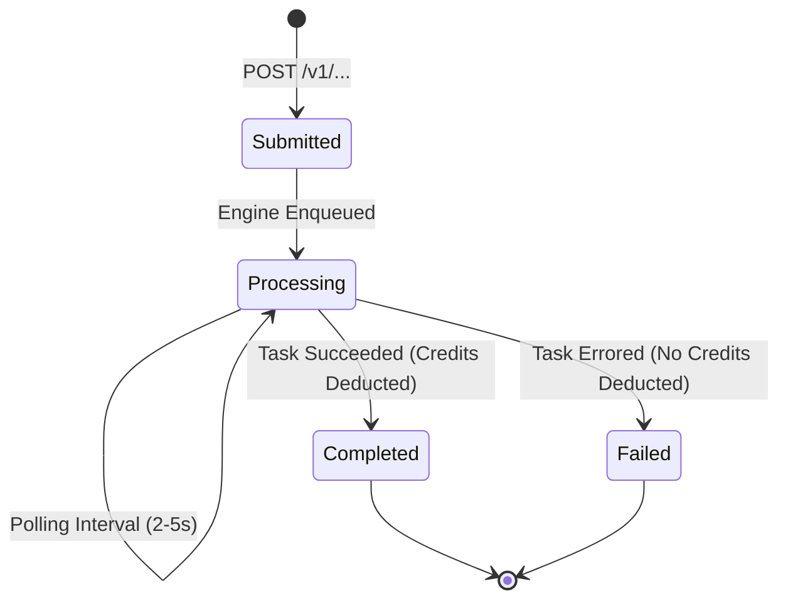

# Check Status - FortyGuard Temperature API®

> **Official Endpoint:** `GET https://api.fortyguard.com/v1/status/{activity_id}`  
> **Plan Availability:** <span style="color:#10b981;font-weight:bold;">BOTH</span> (Available across all plans)  
> **Official Docs Source:** [https://docs-api.fortyguard.com/docs/check-status](https://docs-api.fortyguard.com/docs/check-status)

This endpoint allows you to check the status of any submitted activity using the unique activity ID. When the activity is completed, the response will include the final results and output data.

---

## 📋 Path Parameters

| Parameter | Type | Required | Description |
| :--- | :--- | :--- | :--- |
| `activity_id` | `string` (UUID) | **Yes** | The unique task identifier returned by any of the POST analysis submission endpoints. |

---

## 🔄 Task Lifecycle States



---

## 💻 Polling Implementation (Python)

```python
import time
import requests

def poll_fortyguard_task(activity_id: str, api_key: str, max_timeout: int = 120, interval: int = 3):
    headers = {"api-key": api_key}
    status_url = f"https://api.fortyguard.com/v1/status/{activity_id}"
    
    start_time = time.time()
    while time.time() - start_time < max_timeout:
        res = requests.get(status_url, headers=headers)
        if res.status_code == 404:
            # Task not yet indexed, wait and retry
            time.sleep(interval)
            continue
            
        res.raise_for_status()
        body = res.json()
        status = body.get("data", {}).get("status")
        
        if status == "Completed":
            return body["data"]["result"]
        elif status == "Failed":
            raise RuntimeError(f"Task failed: {body.get('message')}")
            
        time.sleep(interval)
        
    raise TimeoutError(f"Task {activity_id} timed out after {max_timeout}s")
```

---

## 📥 Response Formats

### 1. In-Progress Response
```json
{
  "error": false,
  "status_code": 200,
  "message": "Processing",
  "data": {
    "activity_id": "f3e1c68b-1cc3-46bc-8589-1faaf30ef30a",
    "status": "Processing"
  }
}
```

### 2. Completed Response
```json
{
  "error": false,
  "status_code": 200,
  "message": "Completed",
  "data": {
    "activity_id": "f3e1c68b-1cc3-46bc-8589-1faaf30ef30a",
    "status": "Completed",
    "result": {
      ...
    }
  }
}
```
