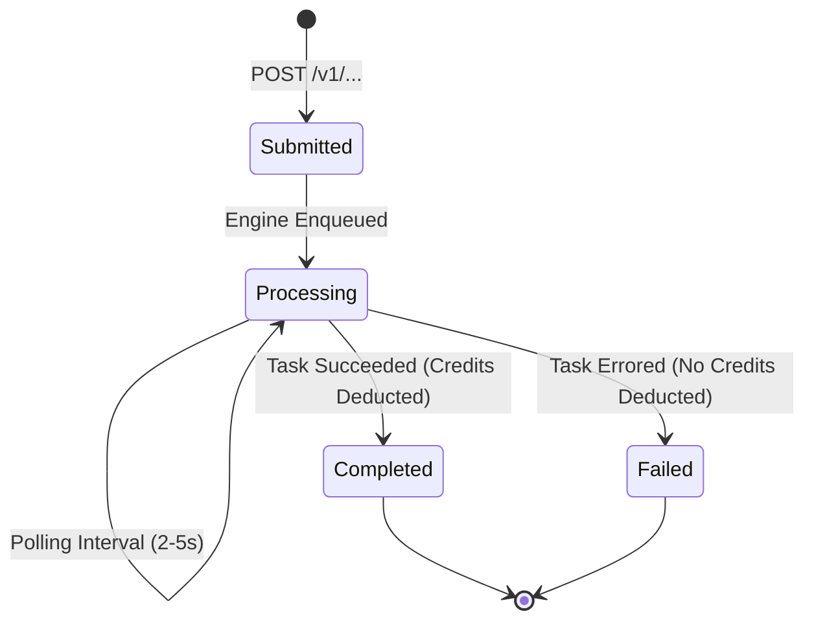

# 🌐 FortyGuard Temperature API® — Master Technical Reference

> **Base URL:** `https://api.fortyguard.com`  
> **Auth Header:** `api-key: YOUR_API_KEY`  
> **Official Docs:** [https://docs-api.fortyguard.com](https://docs-api.fortyguard.com)  

---

# Introduction — FortyGuard Temperature API®

> **Official Docs Source:** [https://docs-api.fortyguard.com/docs/introduction](https://docs-api.fortyguard.com/docs/introduction)  
> **Framework:** FortyGuard Temperature Operating System (tOS)  
> **Core Engine:** Proprietary Large Temperature Models (LTMs)  

As cities grapple with intensifying heat and climate volatility, the need for precise, actionable urban temperature intelligence has never been more urgent. The FortyGuard API Services framework responds to this challenge by offering a powerful suite of heat-intelligent endpoints that translate granular temperature data into operational insights.

This documentation provides a comprehensive overview of the technical capabilities, service architecture, and data workflows that define FortyGuard's **Temperature API®**. Built upon our proprietary **Large Temperature Models (LTMs)**, these APIs enable developers, urban planners, logistics coordinators, and policymakers to seamlessly integrate climate context into digital platforms and physical infrastructure decisions.

---

## 🌟 Core Capabilities

Our API suite provides:
- **Real-Time & Forecasted Heatmaps:** High-resolution 2-meter air temperature mapping across 60m, 80m, and 100m spatial resolutions with up to 12-hour predictive forecasting.
- **Advanced Computer Vision Segmentation:** Pixel-level classification of satellite imagery and street-level panoramic views to quantify urban materials, vegetation, and thermal properties.
- **Comprehensive Environmental Parameters:** Multi-dimensional microclimate indices including Heat Index, Apparent Temperature, Wet-Bulb Temperature, AQI pollutants (PM2.5, PM10, NO₂, CO, O₃, SO₂), greenhouse gases (CO₂, Methane), and Solar Irradiance (GHI, DNI, DHI).
- **Heat Intelligence & Property Reports:** Automated multi-dimensional diagnostic reports synthesizing Geographic, Environmental, Urban, Event-based, and Anthropogenic factors.

---

## 🏷️ Plan Availability & Tiers

Each endpoint in this documentation is tagged with its subscription requirement:

| Tier Badge | Description | Included Services |
| :--- | :--- | :--- |
| <span style="color:#10b981;font-weight:bold;">BOTH</span> | Available on both **API Basic** and **API Premium** | Heatmaps (up to 10 mi²), Map Statistics, Environmental Parameters (up to 3/request), Status Polling, Credit Tracking |
| <span style="color:#3b82f6;font-weight:bold;">BASIC</span> | Included in **API Basic** | 1,000,000 monthly credits, Commercial License, Heatmap generation (≤10 mi²), Environmental Parameters (≤3/req) |
| <span style="color:#8b5cf6;font-weight:bold;">PREMIUM</span> | Exclusive to **API Premium** | 5,000,000 monthly credits, Commercial License, Heatmap generation (≤50 mi²), Full Environmental Parameters, Tile Satellite Segmentation, Street View Segmentation, Heat Intelligence Reports |

---

## 🏙️ Key Use Cases

1. **Climate-Aware Infrastructure Planning:**  
   Use temperature intelligence and environmental parameters to design and maintain roads, transformers, electrical enclosures, bridges, and public utilities to withstand extreme heat stress.
2. **Property & Asset Intelligence:**  
   Generate property-level heat performance reports to assess livability, operational efficiency, and financial risk—supporting ESG appraisals and insurance underwriting.
3. **Smart Mobility & Logistics:**  
   Integrate thermal comfort-based routing and forecasted heat zones into transportation networks, delivery fleets, and cold chains to reduce energy consumption and improve worker safety.
4. **Environmental & Health Monitoring:**  
   Track apparent temperature, wet-bulb thresholds, and air quality pollutants to power heatwave early warning systems.
5. **Urban Design & Public Space Optimization:**  
   Leverage microclimate models to guide placement of shade canopies, cool pavement coatings, and urban greening.
6. **Energy & Building Systems Planning:**  
   Combine solar irradiance, temperature, and humidity data to forecast HVAC cooling loads and optimize renewable energy placement.


---

# Quickstart Guide — FortyGuard Temperature API®

> **Official Docs Source:** [https://docs-api.fortyguard.com/docs/quickstart](https://docs-api.fortyguard.com/docs/quickstart)

Get started with the FortyGuard Enterprise API in minutes. This guide will help you authenticate, make your first asynchronous request, track its lifecycle, and retrieve your final results.

---

## 🔑 1. Authentication

All requests to the FortyGuard Enterprise API require an API key passed in the request headers:

```http
api-key: YOUR_API_KEY
Content-Type: application/json
```

> [!NOTE]
> No OAuth or token exchange is required. Your API key alone provides secure, authenticated access.

---

## 🚀 2. Asynchronous Task Workflow

The FortyGuard Engine processes high-resolution geospatial models and Large Temperature Models asynchronously:

1. **Submit Task (POST):** You call an analysis endpoint (e.g. `/v1/heatmap`, `/v1/env_params`, `/v1/satellite`, `/v1/streetview`, `/v1/heat_intelligence`).
2. **Receive Activity ID:** The API immediately returns an `activity_id` with status `"Processing"`.
3. **Poll Status (GET):** Query `GET /v1/status/{activity_id}` until the status transitions to `"Completed"` or `"Failed"`.
4. **Retrieve Results:** The completed status response body contains your final data payload (GeoJSON, array data, or download link).

---

## 📊 Status & Response Codes Table

| Response / Status | Meaning | Action Required |
| :--- | :--- | :--- |
| **200 / 202** | Request accepted or status retrieved | Inspect JSON response |
| **400 / 422** | Invalid request parameters or validation error | Fix payload format (coordinates, dates) |
| **401** | Missing or invalid API key | Verify `api-key` header |
| **403** | Insufficient plan access or unauthorized tier | Upgrade to API Premium if required |
| **404** | Activity not found or not yet indexed | Retry status check after a short delay |
| **429** | Rate limit exceeded | Back off and retry |
| **500** | Server-side processing error | Check logs and retry or contact support |
| **`Submitted` / `Processing`** | Task is actively computing | Continue bounded polling (e.g. every 2–5s) |
| **`Completed`** | Task finished successfully | Retrieve result data payload (Credits deducted) |
| **`Failed`** | Task execution failed | Stop polling, record activity_id (No credits deducted) |

> [!IMPORTANT]
> Credits are **only deducted** after successful task completion (`status: "Completed"`). Failed tasks do not consume credits.

---

## 🐍 End-to-End Python Example

```python
import time
import requests

API_KEY = "YOUR_API_KEY"
HEADERS = {
    "api-key": API_KEY,
    "Content-Type": "application/json"
}

# -------------------------------------------------------------
# Step 1: Submit your task (e.g. Heatmap generation)
# -------------------------------------------------------------
submit_url = "https://api.fortyguard.com/v1/heatmap"
payload = {
    "polygon_aoi": {
        "type": "FeatureCollection",
        "features": [
            {
                "type": "Feature",
                "properties": {},
                "geometry": {
                    "type": "Polygon",
                    "coordinates": [[
                        [-74.0170, 40.7050],
                        [-74.0030, 40.7050],
                        [-74.0030, 40.7180],
                        [-74.0170, 40.7180],
                        [-74.0170, 40.7050]
                    ]]
                }
            }
        ]
    },
    "date_time": {
        "start_date": "2024-07-15",
        "start_time": "14:00",
        "filter_type": 1  # Single Hour
    },
    "granularity": 100
}

response = requests.post(submit_url, headers=HEADERS, json=payload)
response.raise_for_status()
submit_data = response.json()

activity_id = submit_data["data"]["activity_id"]
print(f"Task submitted successfully. Activity ID: {activity_id}")

# -------------------------------------------------------------
# Step 2: Poll task status until Completed or Failed
# -------------------------------------------------------------
status_url = f"https://api.fortyguard.com/v1/status/{activity_id}"
max_attempts = 30
poll_interval_seconds = 3

for attempt in range(max_attempts):
    time.sleep(poll_interval_seconds)
    status_response = requests.get(status_url, headers=HEADERS)
    
    if status_response.status_code == 200:
        result_data = status_response.json()
        current_status = result_data["data"].get("status")
        print(f"[{attempt + 1}/{max_attempts}] Status: {current_status}")
        
        if current_status == "Completed":
            print("Task completed successfully!")
            results = result_data["data"]["result"]
            # Process GeoJSON tiles or statistics
            print(f"Received result keys: {list(results.keys())}")
            break
        elif current_status == "Failed":
            print(f"Task failed: {result_data.get('message', 'Unknown failure')}")
            break
    else:
        print(f"Status check HTTP {status_response.status_code}: {status_response.text}")
```


---

# Authentication — FortyGuard Temperature API®

> **Official Docs Source:** [https://docs-api.fortyguard.com/docs/authentication](https://docs-api.fortyguard.com/docs/authentication)

FortyGuard's Enterprise API uses direct **API key–based authentication** to ensure secure and controlled access to all endpoints.

Every request to the API must include a valid API Key provided upon registration or via your organization's FortyGuard dashboard.

---

## 🔒 Header Specification

Include your API key in the HTTP request header:

```http
api-key: YOUR_API_KEY
```

- **Header Name:** `api-key` (case-insensitive in HTTP/1.1 and HTTP/2)
- **Value:** Your active FortyGuard API Key string
- **Protocol:** HTTPS (All non-TLS requests are rejected)

---

## 🛡️ Security Best Practices

1. **Keep Keys Confidential:** Never expose API keys in client-side applications (browsers, mobile apps) or commit them to public version control repositories.
2. **Use Environment Variables:** Store keys in secure environment variables (`FORTYGUARD_API_KEY`) or secret management vaults (AWS Secrets Manager, GCP Secret Manager, Doppler).
3. **Server-Side Proxy:** Route frontend requests through your own backend server to inject the `api-key` header securely.

---

## 💻 Code Examples

### cURL
```bash
curl -X POST https://api.fortyguard.com/v1/heatmap \
  -H "api-key: YOUR_API_KEY" \
  -H "Content-Type: application/json" \
  -d '{"granularity": 100, ...}'
```

### Python
```python
import os
import requests

api_key = os.environ.get("FORTYGUARD_API_KEY", "YOUR_API_KEY")
headers = {
    "api-key": api_key,
    "Content-Type": "application/json"
}

response = requests.get("https://api.fortyguard.com/v1/status/test_id", headers=headers)
```

### Node.js / JavaScript
```javascript
const apiKey = process.env.FORTYGUARD_API_KEY || "YOUR_API_KEY";

const response = await fetch("https://api.fortyguard.com/v1/heatmap", {
  method: "POST",
  headers: {
    "api-key": apiKey,
    "Content-Type": "application/json"
  },
  body: JSON.stringify({ ... })
});
```


---

# Create Heatmap — FortyGuard Temperature API®

> **Official Endpoint:** `POST https://api.fortyguard.com/v1/heatmap`  
> **Plan Availability:** <span style="color:#10b981;font-weight:bold;">BOTH</span> (Basic: Up to 10 mi² | Premium: Up to 50 mi²)  
> **Official Docs Source:** [https://docs-api.fortyguard.com/docs/create-heatmap](https://docs-api.fortyguard.com/docs/create-heatmap)

The Heatmap Generation feature produces high-resolution thermal maps derived from spatial and temporal inputs. Built on FortyGuard's proprietary Large Temperature Models (LTMs), each output is a GeoJSON polygon layer with tiles containing predicted or observed temperature data.

---

## 🎯 Overview & Analytics Modes

The Heatmap Generation endpoint computes 2-meter air temperature rasters across polygon areas of interest. It supports 4 distinct analytical modes via `analytic_type`:

1. **`tcm` (Default):** Temperature snapshot raster returning temperature in degrees Celsius (°C) for each spatial grid cell.
2. **`time_of_measure`:** Returns the exact hour of the day (0–23, UTC) at which the maximum peak temperature occurs in each cell.
3. **`exceedance`:** Calculates the total number of hours the temperature exceeded (or fell below) a user-defined threshold (°C) within the time window.
4. **`persistence`:** Calculates the longest continuous consecutive sequence of hours where the temperature remained beyond the threshold (°C). Measures cumulative *thermal soak*.

---

## 📋 Request Parameters

| Parameter | Type | Required | Description |
| :--- | :--- | :--- | :--- |
| `polygon_aoi` | `object` | **Yes** | GeoJSON polygon defining the area of interest for heatmap generation. |
| `date_time` | `object` | **Yes** | Date and time range configuration object. |
| `date_time.start_date` | `string` | **Yes** | Start date in YYYY-MM-DD format. Supported range: 2019-01-01 through 12 hours past the current time.<br>• 2019 up to now — historical / real-time heatmaps<br>• up to 12 hours into the future — forecast heatmaps<br>Dates before 2019, or more than 12 hours ahead of the current time, are rejected with 400 Bad Request. |
| `date_time.filter_type` | `number` | **Yes** | Filter type options:<br>• 1 (Single Hour) - requires start_date and start_time<br>• 2 (Range of Hours, same day) - requires start_date, start_time, and end_time<br>• 3 (Single Day) - requires only start_date (covers 00:00–23:59)<br>• 4 (Range of Days — week / month, ≤ 1 month) - requires start_date and end_date |
| `granularity` | `number` | **Yes** | Spatial resolution/granularity level options:<br>• 60m<br>• 80m<br>• 100m |
| `date_time.end_date` | `string` | No | End date in YYYY-MM-DD format. Required for filter_type 4; auto-populated for filter_type 1–3. |
| `date_time.start_time` | `string` | No | Start time in HH:MM 24-hour format. Required for filter_type 1 and 2. |
| `date_time.end_time` | `string` | No | End time in HH:MM 24-hour format. Required for filter_type 2. Auto-calculated for filter_type 1 (start_time + 1 hour). |
| `analytic_type` | `string` | No | Analysis heatmap type (default 'tcm'):<br>• tcm — Temperature snapshot; value is temperature (°C) per tile<br>• time_of_measure — hour of day (0–23, UTC) at which the peak temperature occurs<br>• exceedance — number of hours the temperature passes the threshold<br>• persistence — longest continuous run of hours past the threshold<br>time_of_measure, exceedance and persistence return values in hours (stats_data.units = "hour"); tcm returns °C. |
| `threshold` | `number` | No | Temperature threshold in °C for exceedance / persistence. Defaults to 30 °C. Ignored by tcm and time_of_measure. |
| `direction` | `string` | No | Threshold direction for exceedance / persistence: 'above' (default) counts hours above the threshold, 'below' counts hours below it. Ignored by tcm and time_of_measure. |


### 🕒 Filter Types Explained

| `filter_type` | Name | Description | Required Parameters |
| :--- | :--- | :--- | :--- |
| **1** | Single Hour | Analyzes a specific 1-hour timestamp | `start_date`, `start_time` |
| **2** | Range of Hours | Analyzes hourly variation within the same day (max 23 hrs) | `start_date`, `start_time`, `end_time` |
| **3** | Single Day | Full 24-hour day aggregate (00:00 to 23:59) | `start_date` |
| **4** | Range of Days | Multi-day or multi-week aggregate (up to 1 month) | `start_date`, `end_date` |

---

## 💻 Request Examples

### 1. Single Hour (Snapshot)
```python
import requests

response = requests.post(
    'https://api.fortyguard.com/v1/heatmap',
    headers={'api-key': 'your_api_key', 'Content-Type': 'application/json'},
    json={
        'polygon_aoi': {
            'type': 'FeatureCollection',
            'features': [
                {
                    'type': 'Feature',
                    'properties': {},
                    'geometry': {
                        'type': 'Polygon',
                        'coordinates': [[
                            [-74.0170, 40.7050],
                            [-74.0030, 40.7050],
                            [-74.0030, 40.7180],
                            [-74.0170, 40.7180],
                            [-74.0170, 40.7050]
                        ]]
                    }
                }
            ]
        },
        'date_time': {
            'start_date': '2024-07-15',
            'start_time': '14:00',
            'filter_type': 1
        },
        'granularity': 100
    }
)
print(response.json())
```

### 2. Exceedance Analysis (Hours above 40°C)
```python
import requests

response = requests.post(
    'https://api.fortyguard.com/v1/heatmap',
    headers={'api-key': 'your_api_key'},
    json={
        'polygon_aoi': {
            'type': 'FeatureCollection',
            'features': [
                {
                    'type': 'Feature',
                    'properties': {},
                    'geometry': {
                        'type': 'Polygon',
                        'coordinates': [[
                            [-74.0170, 40.7050],
                            [-74.0030, 40.7050],
                            [-74.0030, 40.7180],
                            [-74.0170, 40.7180],
                            [-74.0170, 40.7050]
                        ]]
                    }
                }
            ]
        },
        'date_time': {
            'start_date': '2024-07-15',
            'start_time': '06:00',
            'end_time': '18:00',
            'filter_type': 2
        },
        'granularity': 100,
        'analytic_type': 'exceedance',
        'threshold': 40,
        'direction': 'above'
    }
)
```

### 3. Thermal Persistence Analysis (Continuous Soak)
```python
import requests

response = requests.post(
    'https://api.fortyguard.com/v1/heatmap',
    headers={'api-key': 'your_api_key'},
    json={
        'polygon_aoi': {
            'type': 'FeatureCollection',
            'features': [
                {
                    'type': 'Feature',
                    'properties': {},
                    'geometry': {
                        'type': 'Polygon',
                        'coordinates': [[
                            [-74.0170, 40.7050],
                            [-74.0030, 40.7050],
                            [-74.0030, 40.7180],
                            [-74.0170, 40.7180],
                            [-74.0170, 40.7050]
                        ]]
                    }
                }
            ]
        },
        'date_time': {
            'start_date': '2024-07-15',
            'start_time': '06:00',
            'end_time': '18:00',
            'filter_type': 2
        },
        'granularity': 100,
        'analytic_type': 'persistence',
        'threshold': 35,
        'direction': 'above'
    }
)
```

### 4. Time of Measure Analysis (Peak Hour)
```python
import requests

response = requests.post(
    'https://api.fortyguard.com/v1/heatmap',
    headers={'api-key': 'your_api_key'},
    json={
        'polygon_aoi': {
            'type': 'FeatureCollection',
            'features': [
                {
                    'type': 'Feature',
                    'properties': {},
                    'geometry': {
                        'type': 'Polygon',
                        'coordinates': [[
                            [-74.0170, 40.7050],
                            [-74.0030, 40.7050],
                            [-74.0030, 40.7180],
                            [-74.0170, 40.7180],
                            [-74.0170, 40.7050]
                        ]]
                    }
                }
            ]
        },
        'date_time': {
            'start_date': '2024-07-15',
            'filter_type': 3
        },
        'granularity': 100,
        'analytic_type': 'time_of_measure'
    }
)
```

---

## 📥 Responses

### 1. Initial Submission Response (HTTP 200)
```json
{
  "error": false,
  "status_code": 200,
  "message": "Heatmap Submitted Successfully",
  "data": {
    "activity_id": "f52d2453-6a59-4b31-afa3-8fe3bb1ac5df"
  }
}
```

### 2. Completed Status Response (HTTP 200 from GET /v1/status/{activity_id})
```json
{
  "error": false,
  "status_code": 200,
  "message": "Completed",
  "data": {
    "activity_id": "f52d2453-6a59-4b31-afa3-8fe3bb1ac5df",
    "status": "Completed",
    "result": {
      "map_data": {},
      "stats_data": {}
    }
  }
}
```

### 📊 Result Schema Breakdown
Once the heatmap generation activity has finished processing, the final response contains two main outputs:
• GeoJSON heatmap tiles (map_data)
• Aggregated temperature statistics (stats_data)

This response is returned when the activity status is "Completed".

#### `Result.map_data` (`GeoJSON FeatureCollection`)
Tile-based heatmap output formatted as GeoJSON polygons.

#### `Result.stats_data` (`object`)
Aggregated statistical summary of all tiles in the heatmap. This includes:
• Temperature_stats - Temperature statistics across the heatmap region
  - Minimum: Lowest temperature across the heatmap region
  - Maximum: Highest temperature across the heatmap region
  - Mean: Average temperature value
  - Standard_deviation: Variability of temperatures across tiles
• Overall_temperature_distribution (array[number]) - Sorted temperature values representing the overall distribution
• Normal_temperature_distribution (object) - Normalized curve data for plotting a temperature distribution
  - x_axis: Temperature range
  - y_axis: Probability density values
• Temperature_frequency (object) - Histogram-style frequency counts for temperature bins


---

# Satellite View Segmentation — FortyGuard Temperature API®

> **Official Endpoint:** `POST https://api.fortyguard.com/v1/satellite`  
> **Plan Availability:** <span style="color:#8b5cf6;font-weight:bold;">PREMIUM</span> (API Premium plan only)  
> **Official Docs Source:** [https://docs-api.fortyguard.com/docs/satellite-view-segmentation](https://docs-api.fortyguard.com/docs/satellite-view-segmentation)

This endpoint performs segmentation analysis on satellite imagery to identify and classify different land cover types, building structures, vegetation, and thermal characteristics using tile-based (single point) segmentation.

---

## 📋 Request Parameters (Tile-based)

| Parameter | Type | Required | Description |
| :--- | :--- | :--- | :--- |
| `sat` | `object` | **Yes** | Satellite data object containing location coordinates. |
| `sat.latitude` | `number` | **Yes** | Latitude coordinate of the location. |
| `sat.longitude` | `number` | **Yes** | Longitude coordinate of the location. |
| `date_time` | `object` | **Yes** | Date and time range configuration object. |
| `date_time.start_date` | `string` | **Yes** | Start date in YYYY-MM-DD format. Must fall between 2019-01-01 and 12 hours past the current time, and should match the date/time of the heatmap you generated for this location. Out-of-range dates are rejected with 400 Bad Request. |
| `date_time.filter_type` | `number` | **Yes** | Filter type options:<br>• 1 (Single Hour) - requires start_date and start_time<br>• 2 (Range of Hours) - requires start_date, start_time, and end_time<br>• 3 (Single Day) - requires only start_date |
| `granularity` | `number` | **Yes** | Spatial resolution/granularity level options:<br>• 60<br>• 80<br>• 100 |
| `date_time.end_date` | `string` | No | End date in YYYY-MM-DD format. Auto-populated based on filter_type. |
| `date_time.start_time` | `string` | No | Start time in HH:MM 24-hour format. Required for filter_type 1 and 2. |
| `date_time.end_time` | `string` | No | End time in HH:MM 24-hour format. Required for filter_type 2. |


---

## 💻 Request Example (Python)

```python
import requests

response = requests.post(
    'https://api.fortyguard.com/v1/satellite',
    headers={
        'api-key': 'YOUR_API_KEY',
        'Content-Type': 'application/json'
    },
    json={
        'sat': {
            'latitude': 41.84632807720175,
            'longitude': -87.74329628220852
        },
        'date_time': {
            'start_date': '2024-07-15',
            'start_time': '14:00',
            'filter_type': 1
        },
        'granularity': 80
    }
)

print(response.json())
```

---

## 📥 Responses

### 1. Initial Submission Response (HTTP 200)
```json
{
  "error": false,
  "status_code": 200,
  "message": "Satellite Segmentation Submitted Successfully",
  "data": {
    "activity_id": "66dc8797-e17b-4929-af39-5078ce4fc45a"
  }
}
```

### 2. Completed Status Response (HTTP 200 from GET /v1/status/{activity_id})
```json
{
  "error": false,
  "status_code": 200,
  "message": "Completed",
  "data": {
    "activity_id": "66dc8797-e17b-4929-af39-5078ce4fc45a",
    "status": "Completed",
    "result": {
      "coordinates": {
        "latitude": "41.84632807720175",
        "longitude": "-87.74329628220852"
      },
      "orignal_image": [""],
      "image_year": 2026,
      "segmentation": {
        "image_dimensions": {
          "height": 350,
          "width": 350
        },
        "mode": "sat",
        "processing_time_seconds": 0.273295,
        "request_id": "632fcd03",
        "segments": {},
        "image_legend": {},
        "image_content": ""
      }
    }
  }
}
```

### 📊 Result Schema Breakdown
Once the satellite segmentation activity has finished processing, the final response contains three main outputs:
• Location metadata (coordinates) - the latitude/longitude that was analyzed
• Source imagery (orignal_image) - the original satellite image returned as Base64
• Segmentation outputs (segmentation) - class coverage %, legend colors, and the segmentation mask returned as Base64

This response is returned when the activity status is "Completed".

#### `Coordinates` (`object`)
Location that was analyzed.
• latitude (string) - Latitude value
• longitude (string) - Longitude value

#### `Orignal_image` (`array[string]`)
One or more Base64-encoded original satellite images (typically PNG/JPEG). Note: If you return raw Base64 (no prefix), users may need to prepend: data:image/png;base64, to render in a browser.

#### `Image_year` (`number`)
Year of the satellite imagery used for the segmentation.

#### `Segmentation` (`object`)
Model output + metadata for the satellite image.
• image_dimensions (object) - Output image size in pixels
  - height (number): Pixel height
  - width (number): Pixel width
• mode (string) - Processing mode (e.g., "sat" for satellite)
• processing_time_seconds (number) - Time taken to run segmentation (seconds)
• request_id (string) - Internal identifier for tracing/debugging
• segments (object) - Class coverage values (typically percentages)
• image_legend (object) - RGB legend for rendering the segmentation mask
• image_content (string) - Base64-encoded segmentation mask image, decode to display/save the segmentation output. Note: If raw Base64, users may need data:image/png;base64, to render in a browser

> [!NOTE]
> Image encoding: Base64 images are returned in `orignal_image` and `segmentation.image_content`. To display them in a web browser or Jupyter notebook, prepend `data:image/png;base64,` if no data URI header is present.


---

# Street View Segmentation — FortyGuard Temperature API®

> **Official Endpoint:** `POST https://api.fortyguard.com/v1/streetview`  
> **Plan Availability:** <span style="color:#8b5cf6;font-weight:bold;">PREMIUM</span> (API Premium plan only)  
> **Official Docs Source:** [https://docs-api.fortyguard.com/docs/street-view-segmentation](https://docs-api.fortyguard.com/docs/street-view-segmentation)

This endpoint performs segmentation analysis on street view imagery to identify and classify urban features, building facades, vegetation, road surfaces, and thermal characteristics from ground-level perspectives.

---

## 📋 Request Parameters

| Parameter | Type | Required | Description |
| :--- | :--- | :--- | :--- |
| `latitude` | `number` | **Yes** | Latitude coordinate of the street view location. |
| `longitude` | `number` | **Yes** | Longitude coordinate of the street view location. |
| `vertical_angle` | `number` | **Yes** | Vertical viewing angle in degrees (tilt up/down). |
| `horizontal_angle` | `number` | **Yes** | Horizontal viewing angle in degrees (pan left/right, 0-360). |
| `back_view` | `boolean` | **Yes** | Whether to capture the back view (opposite direction). |


---

## 💻 Request Example (Python)

```python
import requests

response = requests.post(
    'https://api.fortyguard.com/v1/streetview',
    headers={
        'api-key': 'YOUR_API_KEY',
        'Content-Type': 'application/json'
    },
    json={
        'latitude': 40.7128,
        'longitude': -74.0060,
        'vertical_angle': 10.0,
        'horizontal_angle': 90.0,
        'back_view': False
    }
)

print(response.json())
```

---

## 📥 Responses

### 1. Initial Submission Response (HTTP 200)
```json
{
  "error": false,
  "status_code": 200,
  "message": "Street View Segmentation Submitted Successfully",
  "data": {
    "activity_id": "e574b989-c100-4a03-97d8-beef65656623"
  }
}
```

### 2. Completed Status Response (HTTP 200 from GET /v1/status/{activity_id})
```json
{
  "error": false,
  "status_code": 200,
  "message": "Completed",
  "data": {
    "activity_id": "e574b989-c100-4a03-97d8-beef65656623",
    "status": "Completed",
    "result": {
      "coordinates": {
        "latitude": "40.7128",
        "longitude": "-74.006"
      },
      "front": {
        "original_image": "",
        "segments": {},
        "image_legend": {},
        "segmented_image": "",
        "image_date": "YYYY-MM-DD"
      }
    }
  }
}
```

### 📊 Result Schema Breakdown
#### `Coordinates` (`object`)
Location that was analyzed.
• latitude (string) - Latitude value
• longitude (string) - Longitude value

#### `Front` (`object`)
Street View "front" camera results for that location.
• original_image (string) - Base64-encoded original street view image. Note: If raw Base64, users may need data:image/png;base64, to render in a browser
• segments (object) - Class coverage values (typically percentages of the image)
• image_legend (object) - RGB color legend for rendering the segmentation output
• segmented_image (string) - Base64-encoded segmentation mask image, decode to display/save the segmentation output
• image_date (string) - Date the Street View image was captured, in YYYY-MM-DD format


---

# Heat Intelligence — FortyGuard Temperature API®

> **Official Endpoint:** `POST https://api.fortyguard.com/v1/heat_intelligence`  
> **Plan Availability:** <span style="color:#8b5cf6;font-weight:bold;">PREMIUM</span> (API Premium plan only)  
> **Official Docs Source:** [https://docs-api.fortyguard.com/docs/heat-intelligence](https://docs-api.fortyguard.com/docs/heat-intelligence)

Heat Intelligence transforms raw temperature data into comprehensive, multi-dimensional intelligence reports for any urban location. This service examines spatial and temporal temperature patterns through five targeted analytics categories—Geographic, Environmental, Urban, Events, and Anthropogenic—providing deep, actionable insights for urban planning, climate resilience, and infrastructure design.

---

## 📋 Request Parameters

| Parameter | Type | Required | Description |
| :--- | :--- | :--- | :--- |
| `latitude` | `number` | **Yes** | Latitude coordinate of the location to analyze. |
| `longitude` | `number` | **Yes** | Longitude coordinate of the location to analyze. |
| `temperature` | `number` | **Yes** | Temperature value in degrees Celsius for the location. |
| `date` | `string` | **Yes** | Date for the temperature reading in YYYY-MM-DD format. Must fall between 2019-01-01 and 12 hours past the current time, and should match the date/time of the heatmap that produced this temperature. Out-of-range dates are rejected with 400 Bad Request. |
| `analysis` | `array[string]` | **Yes** | Type of analysis options:<br>• "geographic"<br>• "environmental"<br>• "urban"<br>• "events"<br>• "anthropogenic" |


### 🔬 Analysis Dimensions

Pass a list containing any of the 5 supported analysis categories in the `analysis` array:
- `"geographic"` — Topographic, elevation, and regional spatial heat patterns.
- `"environmental"` — Atmospheric, humidity, solar exposure, and microclimate factors.
- `"urban"` — Built environment, building footprint, surface materials, and canyon heat entrapment.
- `"events"` — Anomalous microclimate spikes and temporal heatwave events.
- `"anthropogenic"` — Human-made heat emissions (traffic, industrial equipment, AC heat exhaust).

---

## 💻 Request Example (Python)

```python
import requests

response = requests.post(
    'https://api.fortyguard.com/v1/heat_intelligence',
    headers={
        'api-key': 'YOUR_API_KEY',
        'Content-Type': 'application/json'
    },
    json={
        'latitude': 40.7128,
        'longitude': -74.0060,
        'temperature': 34.5,
        'date': '2024-07-15',
        'analysis': [
            'geographic',
            'environmental',
            'urban',
            'events',
            'anthropogenic'
        ]
    }
)

print(response.json())
```

---

## 📥 Responses

### 1. Initial Submission Response (HTTP 200)
```json
{
  "error": false,
  "status_code": 200,
  "message": "Heat Intelligence Submitted Successfully",
  "data": {
    "activity_id": "f3e1c68b-1cc3-46bc-8589-1faaf30ef30a"
  }
}
```

### 2. Completed Status Response (HTTP 200 from GET /v1/status/{activity_id})
```json
{
  "error": false,
  "status_code": 200,
  "message": "Completed",
  "data": {
    "activity_id": "f3e1c68b-1cc3-46bc-8589-1faaf30ef30a",
    "status": "Completed",
    "result": {
      "download_link": "https://storage.fortyguard.com/reports/heat-intelligence-f3e1c68b.pdf?token=..."
    }
  }
}
```

### 📊 Result Delivery & Schema Info
Heat Intelligence uses the same status endpoint as other asynchronous activities, but the completed status response returns JSON with data.result.download_link. The status endpoint does not stream the PDF directly.

Heat Intelligence report generation may take several minutes. The download_link is temporary. Use it immediately to download the PDF, do not log or share the full signed URL, and stop polling once Completed and download_link are returned. Failed is a terminal status.

> [!WARNING]
> **Temporary Download Link:** `data.result.download_link` is a temporary presigned URL. Fetch and persist the PDF file immediately. Do not log or expose the full signed URL in client-side code.


---

# Environmental Parameters — FortyGuard Temperature API®

> **Official Endpoint:** `POST https://api.fortyguard.com/v1/env_params`  
> **Plan Availability:** <span style="color:#10b981;font-weight:bold;">BOTH</span> (Basic: Up to 3 parameters/request | Premium: Full access to all parameters)  
> **Official Docs Source:** [https://docs-api.fortyguard.com/docs/environmental-parameters](https://docs-api.fortyguard.com/docs/environmental-parameters)

A multidimensional temperature intelligence service offering operationally vital metrics including heat index, apparent temperature, and wet bulb temperature for thermal stress assessment. Captures atmospheric and hydrological variables (precipitation, AQI, ozone levels) plus solar irradiance profiles (GHI, DNI, DHI) to support energy modeling, urban planning, and climate resilience.

---

## 📋 Request Parameters

| Parameter | Type | Required | Description |
| :--- | :--- | :--- | :--- |
| `latitude` | `number` | **Yes** | Latitude coordinate of the location. |
| `longitude` | `number` | **Yes** | Longitude coordinate of the location. |
| `temperature` | `number` | **Yes** | Temperature value in degrees Celsius for the location. |
| `date_time` | `object` | **Yes** | Date and time range configuration object. |
| `date_time.start_date` | `string` | **Yes** | Start date in YYYY-MM-DD format. Must fall between 2019-01-01 and 12 hours past the current time, and should match the date/time of the heatmap you generated for this location. Out-of-range dates are rejected with 400 Bad Request. |
| `date_time.filter_type` | `number` | **Yes** | Filter type options:<br>• 1 (Single Hour) - requires start_date and start_time<br>• 2 (Range of Hours) - requires start_date, start_time, and end_time<br>• 3 (Single Day) - requires only start_date |
| `date_time.end_date` | `string` | No | End date in YYYY-MM-DD format. Auto-populated based on filter_type. |
| `date_time.start_time` | `string` | No | Start time in HH:MM 24-hour format. Required for filter_type 1 and 2. |
| `date_time.end_time` | `string` | No | End time in HH:MM 24-hour format. Required for filter_type 2. |
| `analysis` | `string[]` | No | Optional list of environmental parameters to return. Omit to receive all of them. API Basic and API Startup are limited to 3 parameters per request; API Premium has full access.<br><br>Thermal & atmospheric:<br>• heat_index_celsius — heat index ("feels like"), °C<br>• apparent_temperature_celsius — apparent temperature, °C<br>• wet_bulb_temperature_celsius — wet-bulb temperature, °C<br>• relative_humidity_percent — relative humidity, %<br>• precipitation_mm — precipitation, mm<br>• cloud_cover_octas — effective cloud cover, octas<br>• elevation — ground elevation, m<br><br>Air quality (US AQI) & gases:<br>• air_quality:idx — overall US Air Quality Index<br>• air_quality_pm2p5:idx — AQI, PM2.5<br>• air_quality_pm10:idx — AQI, PM10<br>• air_quality_no2:idx — AQI, nitrogen dioxide<br>• aqi_us_co — AQI, carbon monoxide<br>• air_quality_o3:idx — AQI, ozone<br>• air_quality_so2:idx — AQI, sulphur dioxide<br>• methane_ppb — methane, ppb<br>• co2_ppm — carbon dioxide, ppm<br><br>Solar:<br>• solar_irradiance — clear-sky GHI / DNI / DHI |


---

## 🧪 Environmental Parameters Catalog (`analysis`)

You can specify a subset of parameters in the `analysis` array, or omit `analysis` on Premium to retrieve all available metrics:

### 1. Thermal Stress & Atmospheric
- `heat_index_celsius` — Heat Index ("feels like" temperature accounting for humidity), in °C.
- `apparent_temperature_celsius` — Combined perceptual temperature taking wind, humidity, and radiation into account, in °C.
- `wet_bulb_temperature_celsius` — Wet-bulb temperature indicating thermodynamic heat dissipation limit, in °C. Critical for human survivability & evaporative cooling thresholds.
- `relative_humidity_percent` — Relative atmospheric humidity percentage (0–100%).
- `precipitation_mm` — Liquid precipitation accumulation, in mm.
- `cloud_cover_octas` — Effective cloud cover measured in octas (0–8 scale).
- `elevation` — Ground surface elevation above sea level, in meters (m).

### 2. Air Quality Index (US AQI) & Atmospheric Trace Gases
- `air_quality:idx` — Overall aggregated US Air Quality Index (0–500 scale).
- `air_quality_pm2p5:idx` — AQI sub-index for Fine Particulate Matter ($PM_{2.5}$).
- `air_quality_pm10:idx` — AQI sub-index for Coarse Particulate Matter ($PM_{10}$).
- `air_quality_no2:idx` — AQI sub-index for Nitrogen Dioxide ($NO_2$).
- `aqi_us_co` — AQI sub-index for Carbon Monoxide ($CO$).
- `air_quality_o3:idx` — AQI sub-index for Ground-level Ozone ($O_3$).
- `air_quality_so2:idx` — AQI sub-index for Sulfur Dioxide ($SO_2$).
- `methane_ppb` — Atmospheric Methane concentration in parts per billion (ppb).
- `co2_ppm` — Atmospheric Carbon Dioxide concentration in parts per million (ppm).

### 3. Solar Radiation & Irradiance Profiles
- `solar_irradiance` — Clear-sky solar irradiance components:
  - **GHI (Global Horizontal Irradiance):** Total solar radiation received per unit area by a horizontal surface ($W/m^2$).
  - **DNI (Direct Normal Irradiance):** Solar radiation received per unit area by a surface held perpendicular to solar rays ($W/m^2$).
  - **DHI (Diffuse Horizontal Irradiance):** Solar radiation scattered by atmospheric molecules and aerosols ($W/m^2$).

---

## 💻 Request Example (Python)

```python
import requests

response = requests.post(
    'https://api.fortyguard.com/v1/env_params',
    headers={
        'api-key': 'YOUR_API_KEY',
        'Content-Type': 'application/json'
    },
    json={
        'latitude': 40.7128,
        'longitude': -74.0060,
        'temperature': 32.4,
        'date_time': {
            'start_date': '2024-07-15',
            'start_time': '14:00',
            'filter_type': 1
        },
        'analysis': [
            'heat_index_celsius',
            'apparent_temperature_celsius',
            'wet_bulb_temperature_celsius',
            'relative_humidity_percent',
            'air_quality:idx',
            'solar_irradiance'
        ]
    }
)

print(response.json())
```

---

## 📥 Responses

### 1. Initial Submission Response (HTTP 200)
```json
{
  "error": false,
  "status_code": 200,
  "message": "Environment Parameters Analysis Submitted Successfully",
  "data": {
    "activity_id": "f501e334-572b-40c4-8eb9-c9b679eff6ee"
  }
}
```

### 2. Completed Status Response (HTTP 200 from GET /v1/status/{activity_id})
```json
{
  "error": false,
  "status_code": 200,
  "message": "Completed",
  "data": {
    "activity_id": "UUID_STRING",
    "status": "Completed",
    "result": {
      "metadata": {
        "timezone": "TIMEZONE_STRING",
        "timezone_offset_hours": "NUMBER",
        "time_range": {
          "start": "YYYY-MM-DDTHH:MM:SS±HH:MM",
          "end": "YYYY-MM-DDTHH:MM:SS±HH:MM",
          "interval": "TIME_INTERVAL_STRING",
          "count": "INTEGER"
        },
        "timestamps": [
          "YYYY-MM-DDTHH:MM:SS±HH:MM"
        ]
      },
      "locations": [
        {
          "lat": "NUMBER",
          "lon": "NUMBER",
          "elevation": "NUMBER",
          "temperature": "NUMBER",
          "parameters": {
            "heat_index_celsius": ["NUMBER_OR_NULL"],
            "apparent_temperature_celsius": ["NUMBER_OR_NULL"],
            "relative_humidity_percent": ["NUMBER_OR_NULL"],
            "precipitation_mm": ["NUMBER_OR_NULL"],
            "cloud_cover_octas": ["NUMBER_OR_NULL"],
            "wet_bulb_temperature_celsius": ["NUMBER_OR_NULL"],
            "air_quality:idx": ["NUMBER_OR_NULL"],
            "air_quality_pm2p5:idx": ["NUMBER_OR_NULL"],
            "air_quality_pm10:idx": ["NUMBER_OR_NULL"],
            "air_quality_no2:idx": ["NUMBER_OR_NULL"],
            "aqi_us_co": ["NUMBER_OR_NULL"],
            "air_quality_o3:idx": ["NUMBER_OR_NULL"],
            "air_quality_so2:idx": ["NUMBER_OR_NULL"],
            "methane_ppb": ["NUMBER_OR_NULL"],
            "co2_ppm": ["NUMBER_OR_NULL"]
          },
          "solar_irradiance": {
            "clear_sky": {
              "ghi": "NUMBER",
              "dni": "NUMBER",
              "dhi": "NUMBER"
            },
            "description": "STRING_EXPLANATION_OF_SOLAR_OUTPUT"
          }
        }
      ]
    }
  }
}
```

### 📊 Result Schema & Handling Missing Data
Once the environmental parameters analysis activity has finished processing, the final response contains three main outputs:
• Time metadata (metadata) - timezone + the exact timestamps/time range the data corresponds to
• Location context (locations) - the latitude/longitude (and often elevation) that was analyzed
• Environmental outputs (parameters + solar_irradiance) - time-aligned arrays of weather/comfort, air-quality, gases, and solar irradiance metrics

Missing numeric values:
• New missing numeric environmental values are returned as JSON null
• Older stored responses may still contain legacy -999
• null means data was unavailable from the upstream provider
• Missing values must not be interpreted as zero
• Response arrays and live field names remain unchanged

This response is returned when the activity status is "Completed".

> [!IMPORTANT]
> **Handling Null / Missing Values:**
> - Missing numeric values are returned as JSON `null` (or legacy `-999` in older archives).
> - `null` indicates upstream telemetry unavailability; **never interpret null as zero**.


---

# Check Status — FortyGuard Temperature API®

> **Official Endpoint:** `GET https://api.fortyguard.com/v1/status/{activity_id}`  
> **Plan Availability:** <span style="color:#10b981;font-weight:bold;">BOTH</span> (Available across all plans)  
> **Official Docs Source:** [https://docs-api.fortyguard.com/docs/check-status](https://docs-api.fortyguard.com/docs/check-status)

This endpoint allows you to check the status of any submitted activity using the unique activity ID. When the activity is completed, the response will include the final results and output data.

---

## 📋 Path Parameters

| Parameter | Type | Required | Description |
| :--- | :--- | :--- | :--- |
| `activity_id` | `string` (UUID) | **Yes** | The unique task identifier returned by any of the POST analysis submission endpoints. |

---

## 🔄 Task Lifecycle States



---

## 💻 Polling Implementation (Python)

```python
import time
import requests

def poll_fortyguard_task(activity_id: str, api_key: str, max_timeout: int = 120, interval: int = 3):
    headers = {"api-key": api_key}
    status_url = f"https://api.fortyguard.com/v1/status/{activity_id}"
    
    start_time = time.time()
    while time.time() - start_time < max_timeout:
        res = requests.get(status_url, headers=headers)
        if res.status_code == 404:
            # Task not yet indexed, wait and retry
            time.sleep(interval)
            continue
            
        res.raise_for_status()
        body = res.json()
        status = body.get("data", {}).get("status")
        
        if status == "Completed":
            return body["data"]["result"]
        elif status == "Failed":
            raise RuntimeError(f"Task failed: {body.get('message')}")
            
        time.sleep(interval)
        
    raise TimeoutError(f"Task {activity_id} timed out after {max_timeout}s")
```

---

## 📥 Response Formats

### 1. In-Progress Response
```json
{
  "error": false,
  "status_code": 200,
  "message": "Processing",
  "data": {
    "activity_id": "f3e1c68b-1cc3-46bc-8589-1faaf30ef30a",
    "status": "Processing"
  }
}
```

### 2. Completed Response
```json
{
  "error": false,
  "status_code": 200,
  "message": "Completed",
  "data": {
    "activity_id": "f3e1c68b-1cc3-46bc-8589-1faaf30ef30a",
    "status": "Completed",
    "result": {
      ...
    }
  }
}
```


---

# Check API Credits Usage — FortyGuard Temperature API®

> **Official Endpoints:**  
> - `POST https://api.fortyguard.com/v1/system/fetch-api-key-usage`  
> - `POST https://api.fortyguard.com/v1/system/fetch-api-key-custom-usage`  
> **Plan Availability:** <span style="color:#10b981;font-weight:bold;">BOTH</span> (Available across all plans)  
> **Official Docs Source:** [https://docs-api.fortyguard.com/docs/credits-usage](https://docs-api.fortyguard.com/docs/credits-usage)

Track your API key credit consumption, view current billing cycle limits, inspect subscription status, and monitor per-service credit burn rates.

---

## 🔌 1. Billing Cycle Usage Endpoint

Fetches the current active subscription cycle summary, total quota, used credits, and service breakdown.

- **URL:** `POST https://api.fortyguard.com/v1/system/fetch-api-key-usage`
- **Headers:** `api-key: YOUR_API_KEY` or pass key in JSON body
- **Request Body:**
```json
{
  "api_key": "YOUR_API_KEY"
}
```

### Response Payload Structure
```json
{
  "error": false,
  "status_code": 200,
  "data": {
    "plan_name": "API Premium",
    "total_credits": 5000000,
    "credits_used": 142300,
    "credits_remaining": 4857700,
    "credits_reset_date": "2026-09-01T00:00:00Z",
    "status": "Active",
    "services_breakdown": [
      { "name": "Heatmap Generation", "credits": 85000, "percentage": 59.7 },
      { "name": "Tile Satellite Segmentation", "credits": 25000, "percentage": 17.6 },
      { "name": "Streetview Segmentation", "credits": 18000, "percentage": 12.6 },
      { "name": "Environment Parameter Analysis", "credits": 9300, "percentage": 6.5 },
      { "name": "Heat Intelligence Report", "credits": 5000, "percentage": 3.5 }
    ]
  }
}
```

---

## 🔌 2. Custom Date-Range Usage Endpoint

Fetches granular credit consumption for an arbitrary historical window.

- **URL:** `POST https://api.fortyguard.com/v1/system/fetch-api-key-custom-usage`
- **Headers:** `api-key: YOUR_API_KEY`
- **Request Body:**
```json
{
  "api_key": "YOUR_API_KEY",
  "start_date": "2026-08-01T00:00:00Z",
  "end_date": "2026-08-20T23:59:59Z"
}
```

---

## 🐍 Python Verification Script

```python
import requests

def check_credits(api_key: str):
    url = "https://api.fortyguard.com/v1/system/fetch-api-key-usage"
    res = requests.post(url, json={"api_key": api_key})
    res.raise_for_status()
    data = res.json()["data"]
    
    print(f"Plan: {data.get('plan_name')}")
    print(f"Used: {data.get('credits_used'):,} / {data.get('total_credits'):,} credits")
    print(f"Remaining: {data.get('credits_remaining'):,} credits")
    print(f"Reset Date: {data.get('credits_reset_date')}")

check_credits("YOUR_API_KEY")
```


---

# Error Handling & Diagnostics — FortyGuard Temperature API®

> **Official Docs Source:** [https://docs-api.fortyguard.com/docs/errors](https://docs-api.fortyguard.com/docs/errors)

Understand error codes, response payloads, and mitigation strategies for the FortyGuard Temperature API®.

---

## 🚨 HTTP Status Code Matrix

| Status Code | Reason | Description & Troubleshooting |
| :--- | :--- | :--- |
| **`200 OK`** | Success | Request accepted or status query succeeded. |
| **`400 Bad Request`** | Validation Failure | Invalid geometry, malformed GeoJSON, invalid date format (must be YYYY-MM-DD), out-of-bounds date (< 2019 or > now + 12h), or unsupported filter type. **No credits charged.** |
| **`401 Unauthorized`** | Missing/Invalid Key | Request header `api-key` is missing, expired, or invalid. |
| **`403 Forbidden`** | Tier Limitation | Attempted to call a Premium-only endpoint (e.g., Satellite, Streetview, Heat Intelligence) using an API Basic key, or exceeded plan area limits (>10 mi² on Basic). |
| **`404 Not Found`** | Resource Missing | Invalid `activity_id` or task record not yet synchronized. |
| **`422 Unprocessable`** | Semantic Error | Coordinates outside supported geographic region (current release supports US only). |
| **`429 Too Many Requests`** | Rate Limit | Burst concurrency limit reached. Back off exponentially and retry. |
| **`500 Internal Error`** | Engine Failure | Upstream compute failure during ML execution. Failed activities do **not** deduct credits. |

---

## 📋 Standard Error JSON Payload

```json
{
  "error": true,
  "status_code": 400,
  "message": "Invalid date_time: start_date cannot be earlier than 2019-01-01 or more than 12 hours in the future.",
  "data": null
}
```

---

## 🛡️ Robust Client-Side Resilience Pattern (Python)

```python
import time
import requests
from requests.exceptions import HTTPError

def submit_with_retry(url, headers, payload, max_retries=3):
    for attempt in range(1, max_retries + 1):
        try:
            response = requests.post(url, headers=headers, json=payload, timeout=30)
            
            if response.status_code == 429:
                wait_time = attempt * 2
                print(f"Rate limited (429). Retrying in {wait_time}s...")
                time.sleep(wait_time)
                continue
                
            response.raise_for_status()
            return response.json()
            
        except HTTPError as e:
            if response.status_code in [400, 401, 403, 422]:
                # Permanent client errors - fail immediately
                raise ValueError(f"Client error {response.status_code}: {response.text}") from e
            elif attempt == max_retries:
                raise
            time.sleep(2 ** attempt)
            
    raise RuntimeError("Max retries exceeded")
```


---

# Known Limitations & Plan Comparison — FortyGuard Temperature API®

> **Official Docs Source:** [https://docs-api.fortyguard.com/docs/limitations](https://docs-api.fortyguard.com/docs/limitations)

This document details the operational, technical, geographic, and subscription constraints governing the FortyGuard Temperature API®.

---

## 📊 Plan Limits Matrix

| Capability | API Basic | API Premium | API Startup |
| :--- | :--- | :--- | :--- |
| **Monthly Credits** | **1,000,000** | **5,000,000** | **1,000,000** |
| **Commercial License** | Included | Included | Included |
| **Heatmap Generation (Max Area)** | **Up to 10 mi²** | **Up to 50 mi²** | **Up to 10 mi²** |
| **Map Statistics** | Full access | Full access | Full access |
| **Environmental Parameters** | Up to 3 parameters/request | **Full access to all parameters** | Up to 3 parameters/request |
| **Satellite View Segmentation** | ❌ Not included | **✅ Included** | ❌ Not included |
| **Street View Segmentation** | ❌ Not included | **✅ Included** | ❌ Not included |
| **Heat Intelligence Reports** | ❌ Not included | **✅ Included** | ❌ Not included |
| **Access Window** | Monthly (renews each cycle) | Monthly (renews each cycle) | 6 months (one-time) |
| **Regional Coverage** | United States only | United States only | United States only |

---

## ⚙️ Input Constraints & Validation Rules

Requests violating these constraints return `400 Bad Request` and are **not charged** against your credit balance:

1. **Coordinates:**
   - `latitude` must be in range `[-90, 90]`.
   - `longitude` must be in range `[-180, 180]`.
   - In the current release, coordinates must fall within the **United States**.
2. **Polygon Area of Interest (AOI):**
   - Must be a valid GeoJSON `FeatureCollection` or `Feature` whose geometry is a closed `Polygon` (first and last coordinate vertices must be identical).
   - Maximum area limit: $le 10	ext{ mi}^2$ on Basic/Startup, $le 50	ext{ mi}^2$ on Premium.
3. **Date & Time Formatting:**
   - `start_date` and `end_date` must be formatted as `YYYY-MM-DD`.
   - `start_time` and `end_time` must be formatted as `HH:MM` in 24-hour time.
4. **Date Range & Forecasting Rules:**
   - Historical lower bound: `2019-01-01`.
   - Heatmap forecasting upper bound: `now + 12 hours`.
   - Any date prior to 2019-01-01 or exceeding +12h forecast is rejected with `400 Bad Request`.
   - For Satellite, Streetview, Environmental Parameters, and Heat Intelligence, date/time should match the heatmap generated for the same location.
5. **Filter Types:**
   - `filter_type` must be `1` (Single Hour), `2` (Range of Hours, max 23h), `3` (Single Day), or `4` (Range of Days, max 1 month).
6. **Granularity:**
   - Must be one of `60m`, `80m`, or `100m`.
7. **Heat Intelligence Analysis:**
   - `analysis` array must be a subset of `["geographic", "environmental", "urban", "events", "anthropogenic"]`.

---

## 💳 Billing & Credit Rules

- **Deduction Trigger:** Credits are deducted **only** upon successful task completion (`status: "Completed"`).
- **Failed Tasks:** Tasks failing during engine execution (`status: "Failed"`) do **not** consume credits.
- **Cycle Rollover:** Unused monthly credits do not roll over; they reset on your `credits_reset_date`.
- **Support Contact:** If you encounter unexpected behavior or limits, reach out to `support@fortyguard.com`.


---

# Release Notes — FortyGuard Temperature API®

> **Official Docs Source:** [https://docs-api.fortyguard.com/docs/release-notes](https://docs-api.fortyguard.com/docs/release-notes)

A running log of every change to FortyGuard's Temperature API® and its documentation.

---

## 🚀 Version 1.0.0 — Initial Public Release
*Release Date: April 22, 2026*

First general-availability release of the FortyGuard Enterprise API. Introduces the core Temperature API® surface, two subscription plans, credit tracking, and complete documentation for every supported endpoint.

### ✨ Added (Endpoints & Services)
- `POST /v1/heatmap` — Generate high-resolution GeoJSON thermal maps for a polygon AOI across Single Hour, Range of Hours, Single Day, and Range of Days filters at granularity 60m / 80m / 100m. Supports Snapshot (`tcm`), Time of Measure, Exceedance, and Persistence analytics.
- `POST /v1/satellite` — Tile-based satellite view segmentation with Base64-encoded imagery and per-class coverage metrics.
- `POST /v1/streetview` — Ground-level street view segmentation including front (and optional back) view with per-class coverage metrics.
- `POST /v1/heat_intelligence` — Multi-dimensional Heat Intelligence Reports across Geographic, Environmental, Urban, Events, and Anthropogenic categories, delivered via temporary presigned `download_link`.
- `POST /v1/env_params` — Environmental Parameters including Heat Index, Apparent Temperature, Wet-Bulb Temperature, Relative Humidity, AQI ($PM_{2.5}$, $PM_{10}$, $NO_2$, $CO$, $O_3$, $SO_2$), Methane, $CO_2$, and Solar Irradiance (GHI, DNI, DHI).
- `GET /v1/status/{activity_id}` — Unified status and result-retrieval endpoint for all asynchronous task submissions.
- `POST /v1/system/fetch-api-key-usage` & `POST /v1/system/fetch-api-key-custom-usage` — Real-time credit usage reporting at billing-cycle and custom date-range granularity.
- **Direct API Key Header Auth:** Direct authentication via `api-key` request header (no OAuth or token exchange required).

### 🏷️ Plans & Access Control
- **API Basic Plan:** 1,000,000 monthly credits, commercial license, heatmaps up to 10 mi², full Map Statistics, and up to 3 customizable environmental parameters per request.
- **API Premium Plan:** 5,000,000 monthly credits, commercial license, heatmaps up to 50 mi², full access to all Environmental Parameters, plus Satellite Segmentation, Street View Segmentation, Heat Intelligence Reports, and Temperature Property APIs.
- **Per-endpoint plan badges** and in-page availability banners across all documentation views.

### 📚 Documentation & Developer Tools
- Complete Quickstart guide with asynchronous submit-and-poll code samples.
- Known Limitations and Input Validation rules reference.
- Interactive API Credit Usage tracker tool.

