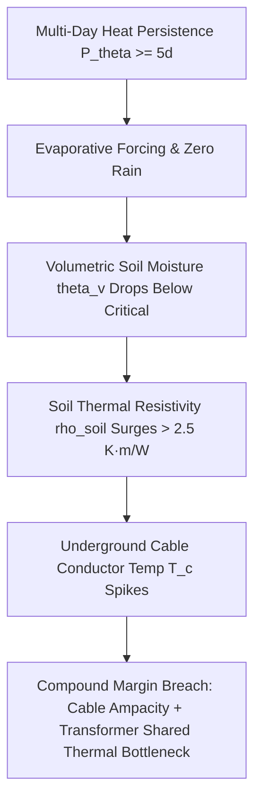
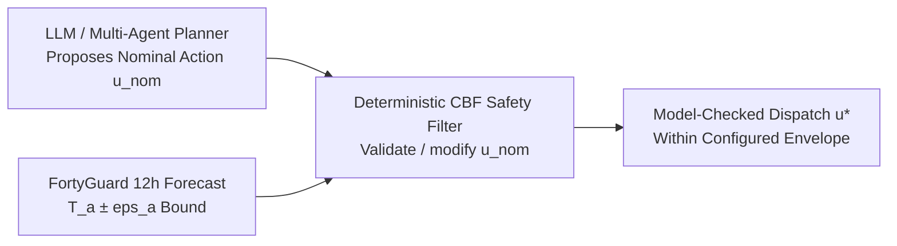
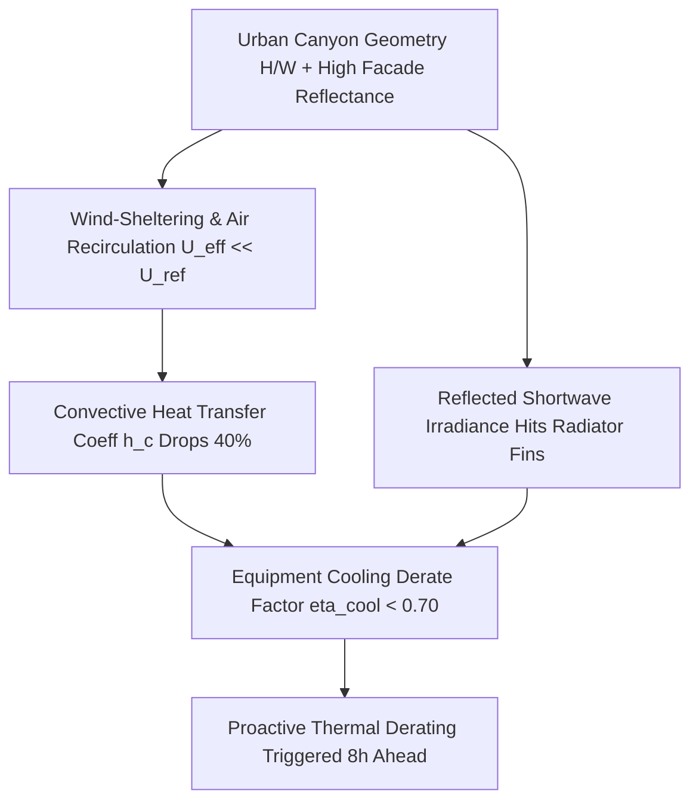
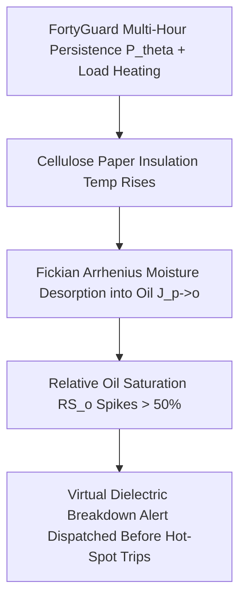

# 🛡️ Thermal Sentinel Grid - Asymmetric Innovation & Advanced Physical Mechanisms
> **FortyGuard Hackathon '26 - Track 06 (Agentic AI) & Track 02 (Future Buildings & Energy)**  
> Four Non-Obvious, Cross-Disciplinary Literature Intersections: Cable-Soil Dry-Out, Robust Control Barrier Functions (CBFs), Urban Canyon Aerodynamic Throttling, and Virtual Paper-Oil Moisture Diffusion.

---

## 🧭 The Asymmetric Differentiation Proposition

```
┌──────────────────────────────────────────────────────────────────────────────────────────────────────────┐
│                                   THE CORE ASYMMETRIC ADVANTAGE                                          │
│                                                                                                          │
│   Generic Competitor Claim:  "AI plots temperatures and sheds load when it exceeds 40°C"                 │
│                                                                                                          │
│   Thermal Sentinel Grid:     "Infers 4 hidden, unmonitored physical states that SCADA misses:            │
│                              1. Underground cable-soil moisture dryout & thermal resistivity surge       │
│                              2. Deterministic bounded-trajectory safety-envelope validation              │
│                              3. Urban canyon aerodynamic wind-sheltering & cooling throttling            │
│                              4. Arrhenius paper-to-oil moisture desorption & dielectric breakdown risk"  │
└──────────────────────────────────────────────────────────────────────────────────────────────────────────┘
```

---

## 1. 🕳️ Buried Cable-Soil Dry-Out (Coupled Multi-Physics Bottleneck)

### 1.1 The Hidden Failure Mechanism
Standard distribution monitoring tracks feeder current and transformer top-oil temperature, but **never observes underground soil moisture or thermal resistivity ($\rho_{\text{soil}}$)** surrounding buried cables.
During multi-day heatwaves ($P_\theta \ge 5\text{ days}$), intense surface heat and lack of precipitation deplete soil moisture. This causes a steep, non-linear spike in $\rho_{\text{soil}}$ (from $0.9\text{ K}\cdot\text{m/W}$ to $> 2.5\text{ K}\cdot\text{m/W}$), drastically impairing heat dissipation and compounding padmount transformer stress at the same physical parcel.



### 1.2 Mathematical Formulation
* **Cable Conductor Temperature ($T_c$):**

$$T_c(t) = T_{\mathrm{soil},\infty}(t) + q_c(t) \cdot R_{\mathrm{th,cable}}(\rho_{\mathrm{soil}}(t))$$

$$q_c(t) = I(t)^2 R_{\mathrm{ac}}(T_c(t)) + W_d(t) + W_s(t)$$

* **Non-Linear Soil Resistivity Surge (Logistic State):**

$$\rho_{\mathrm{soil}}(t) = \rho_{\mathrm{wet}} + \frac{\rho_{\mathrm{dry}} - \rho_{\mathrm{wet}}}{1 + \exp[a(\theta_v(t) - \theta_{\mathrm{crit}})]}$$

* **Shared Site-Risk Margin:**

$$M_{\mathrm{site}}(t) = \min\left[T_{c,\max} - T_c(t), \; T_{o,\max} - T_o(t), \; T_{hs,\max} - T_{hs}(t)\right]$$

### 1.3 Literature & Standards Basis
* **IEC 60287-1-1 / IEC 60853:** Current rating equations and cyclic emergency loading for underground cables.
* **Mazza & Wu (2026):** *"Due-to-Heatwaves Faults in Urban Distribution System: An Identification Approach"* (inferred an 11.25-day delayed fault response driven by cumulative soil-condition degradation).
* **Malmedal et al. (IEEE 2016):** *"The Effect of Underground Cable Diameter on Soil Drying and Thermal Stability."*

---

## 2. 🛡️ Deterministic Safety Filtering Inspired by Control Barrier Functions

### 2.1 The Hidden Failure Mechanism
Generic agentic architectures use simple `if hotspot > 140: shed_load()` heuristics. This intervenes too late, offers zero mathematical guarantees under forecast error, and causes oscillatory chattering.
Thermal Sentinel Grid uses a deterministic **Control Barrier Function-inspired safety filter** to test proposed actions against a configured **safe set $\mathcal{C}$** under bounded FortyGuard 12-hour forecast uncertainty ($T_a \pm \epsilon_a$). The implementation records pass/modify/reject decisions for the modelled trajectory; it is not a field-certified guarantee for an unmodelled physical grid.



### 2.2 Mathematical Formulation
* **Safe Set Definition:**

$$\mathcal{C} = \left\{x \in \mathbb{R}^2 : h_o(x) = T_{o,\max} - T_o \ge 0, \; h_{hs}(x) = T_{hs,\max} - T_{hs} \ge 0\right\}$$

* **Robust Worst-Case Boundary Condition:**

$$T_a^{\mathrm{worst}}(t) = \widehat{T}_a(t) + \epsilon_a$$

* **Discrete-Time Barrier Certificate:**

$$h_i\left(F(x_k, u_k, \widehat{T}_{a,k} + \epsilon_a)\right) \ge (1 - \gamma_i) h_i(x_k) \quad (0 < \gamma_i \le 1)$$

* **Reference CBF-QP formulation from the literature (not the current implementation):**

$$u_k^* = \arg\min_{u, \delta} \left\Vert u - u_{\mathrm{nom},k} \right\Vert_Q^2 + \lambda \left\Vert \delta \right\Vert_2^2$$

$$\text{s.t. } h_i(F(x_k, u, \widehat{T}_{a,k} + \epsilon_a)) \ge (1 - \gamma_i) h_i(x_k) - \delta_i, \quad u_{\min} \le u \le u_{\max}, \quad \delta_i \ge 0$$

The shipped gate instead performs forward simulation and bisection over the permissible load interval.

### 2.3 Literature & Standards Basis
* **Schneeberger, Dörfler & Mastellone (2024):** *"Advanced Safety Filter for Smooth Transient Operation of a Battery Energy Storage System"* (CBF forward invariance for energy storage converters).
* **Ames et al. (IEEE TAC 2017):** *"Control Barrier Function Based Quadratic Programs for Safety Critical Systems."*

---

## 3. 🏙️ Urban Canyon Aerodynamics & Heat Rejection Throttling

### 3.1 The Hidden Failure Mechanism
IEEE transformer standards assume standard free-convective airflow ($h_c \approx 10-15\text{ W/m}^2\text{K}$). In dense urban canyons, building height-to-width ratios ($H/W$) and low sky-view factors cause aerodynamic wind-sheltering, air recirculation, and reflected short-wave irradiance from high-albedo facades, drastically throttling equipment cooling capacity.



### 3.2 Mathematical Formulation
* **Local Equipment Heat Balance:**

$$C_{\mathrm{eq}} \frac{dT_s}{dt} = \dot{Q}_{\mathrm{loss}} - h_c A_s (T_s - T_{\mathrm{canyon}}) - \varepsilon \sigma A_s (T_s^4 - T_{\mathrm{rad}}^4) - \dot{Q}_{\mathrm{active}}$$

* **Morphological Wind-Sheltering Factor ($\kappa_{\mathrm{morph}}$):**

$$U_{\mathrm{eff}} = U_{\mathrm{ref}} \cdot \kappa_{\mathrm{morph}} = U_{\mathrm{ref}} \cdot \text{clip}\left[\exp(-\beta_1 H/W - \beta_2 \lambda_f + \beta_3 \phi_{\mathrm{open}}), \kappa_{\min}, 1.0\right]$$

* **Equipment Cooling Derate Factor ($\eta_{\mathrm{cool}}$):**

$$\eta_{\mathrm{cool}} = \frac{h_c A_s (T_s - T_{\mathrm{canyon}}) + \varepsilon \sigma A_s (T_s^4 - T_{\mathrm{rad}}^4)}{h_{c,\mathrm{ref}} A_s (T_s - T_{2m,\mathrm{ref}})}$$

### 3.3 Literature & Standards Basis
* **T. R. Oke (1981):** *"Canyon Geometry and the Nocturnal Urban Heat Island."*
* **Evola et al. (Applied Energy 2020):** *"A Novel Comprehensive Workflow for Modelling Outdoor Thermal Comfort and Energy Demand in Urban Canyons."*
* **Erell, Pearlmutter & Williamson (2011):** *"Urban Microclimate: Designing the Spaces Between Buildings."*

---

## 4. 🧪 Virtual Moisture Sensor (Paper-to-Oil Migration & Dielectric Breakdown)

### 4.1 The Hidden Failure Mechanism
Distribution transformers lack internal fiber-optic sensors or real-time Dissolved Gas Analysis (DGA). During cumulative thermal soak, water desorbs rapidly from cellulose Kraft paper into oil according to **Fick's Second Law of Diffusion**, drastically increasing oil conductivity and causing sudden dielectric arcing/breakdown *even before hot-spot emergency limits are breached*.



### 4.2 Mathematical Formulation
* **Fickian Cellulose Moisture Diffusion:**

$$\frac{\partial w_p}{\partial t} = \nabla \cdot \left[D_p(T) \nabla w_p\right], \quad D_p(T) = D_{p,0} \exp\left(-\frac{E_a}{R_g T}\right)$$

* **Two-Compartment Paper-Oil State Space:**

$$\begin{bmatrix} \dot{m}_p \\ \dot{m}_o \end{bmatrix} = \begin{bmatrix} -k_{po}(T) & k_{op}(T) \\ k_{po}(T) & -k_{op}(T) - k_{\mathrm{dry}} \end{bmatrix} \begin{bmatrix} m_p \\ m_o \end{bmatrix} + \begin{bmatrix} g_{\mathrm{age}} \\ 0 \end{bmatrix}$$

* **Virtual Dielectric Hazard Index:**

$$RS_o = \frac{w_o}{w_{\mathrm{sat}}(T_o)}, \quad p_{\mathrm{dielectric}} = \sigma(c_0 + c_1 RS_o + c_2 m_p + c_3 T_{hs} + c_4 \dot{T}_{hs} + c_5 \mathbf{1}_{P_\theta \ge 5\mathrm{d}})$$

### 4.3 Literature & Standards Basis
* **Zhou et al. (IET High Voltage 2024):** *"Model Moisture Transport in Oil-Paper Insulation of Transformer: Theory and Experiment."*
* **Fofana et al. (IEEE Trans. Dielectr. Electr. Insul. 2013):** *"Determination of Moisture Diffusion Coefficient for Oil-Impregnated Kraft-Paper Insulation."*
* **IEC 60422 / IEEE C57.106:** Mineral insulating oils supervision and moisture assessment.

---

---

## 5. ⚡ Advanced Grid Physics & Heavy Computational Moats
For complete mathematical monographs, LaTeX formulations, and arXiv citations on our four expanded engineering moats, see **[`ADVANCED_PHYSICS_AND_MATHEMATICAL_PAPERS.md`](ADVANCED_PHYSICS_AND_MATHEMATICAL_PAPERS.md)**:

1. **Dynamic Line Rating & Conductor Catenary Sag (IEEE Std 738-2012):**
   Iterative Newton-Raphson convective, radiative, and solar heat equilibrium ($q_c + q_r = q_s + I^2R$) unlocking $+22.5\%$ dynamic ampacity headroom while preventing ground flashover sag ($S(T_c)$).
2. **Coupled 2-State BESS Electro-Thermal & Arrhenius SEI Capacity Fade:**
   2-state lumped core ($T_c$) vs. surface ($T_s$) differential thermal equations with continuous electrochemical SEI growth ($dQ_{\text{loss}}/dt$), tracking real-time degradation cost (\$/MWh) and enforcing the $55^\circ\mathrm{C}$ thermal runaway ceiling.
3. **Arrhenius-Weibull Grid Fragility & Cascading Blackout Risk:**
   Time-dependent non-homogeneous Poisson-Weibull failure hazard model $\lambda_i(t, T)$ with Arrhenius acceleration $A_F(T)$ integrated across substation assets to output joint cascading failure probability ($P_{\text{cascade}}$).
4. **Analytical Uncertainty-Bounded Dispatch Screen:**
   Gaussian quantile bounds are applied to a simplified four-bus feeder approximation, followed by heuristic BESS, OLTC, and shedding selection. SOCP is the research basis, not the shipped numerical algorithm.

