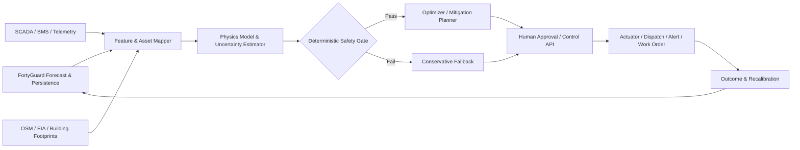

# 🔬 Physical-AI Research Synthesis & Engineering Standards
> **FortyGuard Hackathon '26 - *Building the World's Temperature AI***  
> Rigorous literature foundation, engineering standards (IEEE/IEC, UL, ASHRAE, ISO), multi-agent control architecture, and comparative concept analysis.

---

## 🧭 Executive Summary & The Core Scientific Differentiator

```
┌──────────────────────────────────────────────────────────────────────────────────────────────────────────┐
│                                   THE CORE SCIENTIFIC GAP & SOLUTION                                     │
│                                                                                                          │
│   [Macro Weather Stations]     ──►  Spatially coarse (Airport / Regional tower averaging)                │
│   [Orbital Satellites]         ──►  Measures surface skin temperature (LST), not ambient air             │
│                                                                                                          │
│   [FortyGuard Temperature AI]  ──►  Exact 2-meter ambient air temperature at parcel/street scale (60-100m)│
│                                     + 12-hour forward forecast + Persistence runs + Degree-hour exceedance│
│                                     + Solar irradiance + Land-cover morphology context                   │
│                                                                                                          │
│   [Physical State Estimation]  ──►  Fuses external boundary condition into IEEE C57.91 / IEC 60076-7     │
│                                     transformer differential equations & UL 9540A BESS thermal models    │
│                                                                                                          │
│   [Deterministic Safety Gate]  ──►  Non-LLM deterministic code enforces emergency loading & voltage limits │
└──────────────────────────────────────────────────────────────────────────────────────────────────────────┘
```

### The Meteorological Gap Clarified
Standard meteorological services (NOAA, OpenWeather) often report modeled 2-meter air temperatures, but they are **spatially coarse or sparse point measurements** (interpolating across tens of kilometers). Conversely, satellites measure orbital **Land Surface Temperature (LST)**, which is surface skin temperature, not the ambient air enveloping physical assets.

**FortyGuard is not just a high-resolution map; it provides the external convective & radiative boundary condition:**
1. **$T_{\text{ambient, asset}}(t)$** at the asset's exact 20m-100m street/parcel tile.
2. **Degree-Hour Exceedance ($H_\theta$):** $\int \max(T_{\text{ambient}}(t) - \theta, 0)\,dt$.
3. **Continuous Persistence ($P_\theta$):** $\max\{\text{continuous duration}: T_{\text{ambient}}(t) > \theta\}$.
4. **Land-Cover Morphology:** Asphalt %, building %, and tree canopy % context explaining thermal radiation.
5. **12-Hour Hyperlocal Forecast:** Allows proactive physical intervention before peak thermal soak.

---

## 🏗️ Multi-Agent Architecture with Deterministic Safety Gates



### Agent Roles & Separation of Concerns

* **Sensor Agent:** Validates timestamps, units, sensor drift, and spatial joins.
* **Thermal Forecast Agent:** Ingests FortyGuard 12h forecasts, calculates persistence runs, exceedance degree-hours, wet-bulb, and solar irradiance.
* **Asset Context Agent:** Maps thermal tiles to physical assets (transformers, BESS containers, HVAC loops, data center chillers).
* **Physics Agent:** Computes physical state equations (IEEE/IEC transformer top-oil & hot-spot rise, relative aging rate, UL 9540A thermal limits, WBGT).
* **Risk Agent:** Quantifies probability and consequence of thermal failure.
* **Mitigation Agent:** Formulates feasible interventions (load-shedding, fan pre-cooling, EV charge throttling, dispatch shifts).
* **Safety Gate (Deterministic Code - NOT LLM):** Enforces hard physical constraints (emergency loading limits, voltage envelopes, N-1 reserve, ramp rates).
* **Audit Agent:** Logs telemetry, physical assumptions, tool calls, and human approvals for compliance.

---

## 📚 Detailed Concept Analysis & Standards Basis

### Concept 1: Thermal Sentinel Grid (Top Hackathon Recommendation)
* **Core Hypothesis:** Distribution transformers operating in unshaded, high-irradiance urban heat pockets experience severe thermal aging and hot-spot spikes that static seasonal ratings miss.
* **Standards & Equations:**
 - **IEEE Std C57.91** (*Guide for Loading Mineral-Oil-Immersed Transformers*).
 - **IEC 60076-7** (*Loading Guide for Oil-Immersed Power Transformers*).
 - Top-oil temperature differential equation:
    $$\tau_0 \frac{d\theta_{0}}{dt} = \left[\frac{1 + R K^2}{1 + R}\right]^x \Delta\theta_{0,r} - (\theta_0 - \theta_{\text{amb}})$$
 - Relative insulation aging rate $V$:
    $$V = 2^{(\theta_{\text{hs}} - 110)/6}$$
* **FortyGuard Input:** Ingests parcel $T_{\text{amb}}$, solar radiation, and continuous persistence duration $P_\theta$.
* **Open Data Fusion:** EIA-861/860 (substations & utilities), OpenStreetMap power infrastructure, Microsoft building footprints.
* **Mitigation Output:** Automated fan control, load shifting to parallel transformers, flexible EV charging curtailment, operator alerts.

---

### Concept 2: BESS HeatGuard (Outdoor Battery Energy Storage)
* **Core Hypothesis:** External microclimate thermal persistence is a leading indicator of BESS container cooling stress, exposing degraded HVAC capacity and thermal runaway risk before internal BMS alarms fire.
* **Standards Foundation:**
 - **UL 9540** (Energy Storage Systems Safety).
 - **UL 9540A** (Thermal Runaway Fire Propagation Testing).
 - **NFPA 855** (Standard for the Installation of Stationary Energy Storage Systems).
* **Key Metric - Thermal Recovery Deficit:**
  $$R_{\text{deficit}} = \sum_t \max(T_{\text{container}}(t) - T_{\text{target}}, 0) \quad \text{(during nighttime recovery windows)}$$
* **Mitigation Output:** C-rate charge/discharge throttling, pre-cooling schedules, rack isolation, emergency first-responder notification.

---

### Concept 3: Thermal-Aware Data Center Autopilot
* **Core Hypothesis:** Integrating 2m wet-bulb, dry-bulb, and solar persistence into data center cooling controllers prevents chiller surge and GPU thermal throttling during peak heat.
* **Standards & Benchmarks:**
 - **ASHRAE TC 9.9** (*Thermal Guidelines for Data Processing Environments*).
 - **ASHRAE Guideline 36** (Advanced Control Sequences).
 - **LC-Opt Benchmark (2025):** Closed-loop multi-agent FMU/Modelica cooling control benchmark.
* **Mitigation Output:** Chilled-water setpoint adjustment, cooling tower approach optimization, non-urgent batch workload migration.

---

### Concept 4: HeatChain & WorkerShield (Logistics & Occupational Health)
* **Core Hypothesis:** Hyperlocal thermal persistence dynamically routes perishable cargo and schedules outdoor labor based on cumulative thermal stress.
* **Standards:**
 - **ISO 7243** (Hot environments - Estimation of heat stress using WBGT).
 - **NIOSH Criteria for Occupational Exposure to Heat & Hot Environments**.
 - **ACGIH Threshold Limit Values (TLVs)** for Work/Rest cycles.
* **Mitigation Output:** Dynamic cool corridor routing (OpenStreetMap), work/rest schedule adjustments, reefer pre-cooling.

---

## 🎯 Winning Strategy & Implementation Roadmap

```
                                  REPLAY DEMONSTRATION WORKFLOW
   ┌───────────────────────────────────┐     ┌───────────────────────────────────┐
   │ 1. Historical Heatwave Replay     │ ──► │ 2. Compare 3 Control Baselines:   │
   │    • Select US City (e.g. Phoenix)│     │    A. Static Seasonal Rating      │
   │    • Ingest FortyGuard 2021-2026  │     │    B. Airport Weather Station     │
   │    • Replay extreme heat event    │     │    C. FortyGuard Physical Agent   │
   └───────────────────────────────────┘     └─────────────────┬─────────────────┘
                                                               │
                                                               ▼
                                             ┌───────────────────────────────────┐
                                             │ 3. Prove Measurable Impact:       │
                                             │    • Reduced Loss-of-Life (Aging) │
                                             │    • Zero N-1 Constraint Violation│
                                             │    • Avoided Substation Blowout   │
                                             └───────────────────────────────────┘
```

### JSON Structured Action Contract (Illustrative Schema)

The following is a **schema illustration**, not a captured production result. Numeric fields must be populated from a specific measured boundary and solver run rather than copied from this document.

```json
{
  "asset_id": "<asset-id>",
  "asset_type": "distribution_transformer_pad",
  "location": {"lat": "<latitude>", "lon": "<longitude>"},
  "external_boundary": {
    "fortyguard_2m_ambient_c": "<measured>",
    "persistence_hours_above_40c": "<measured>",
    "solar_irradiance_wm2": "<derived>"
  },
  "physics_estimation": {
    "estimated_top_oil_temp_c": "<modelled>",
    "hot_spot_temp_c": "<modelled>",
    "relative_aging_rate": "<modelled>"
  },
  "safety_gate": {
    "status": "<PASSED|MODIFIED|REJECTED>",
    "ieee_c57_91_compliant": "<boolean>",
    "feeder_voltage_pu": "<modelled>",
    "n_minus_1_reserve_maintained": "<boolean>"
  },
  "recommended_action": "<validated-action>",
  "expected_hotspot_reduction_c": "<modelled>",
  "approval_required": "<policy-value>"
}
```
