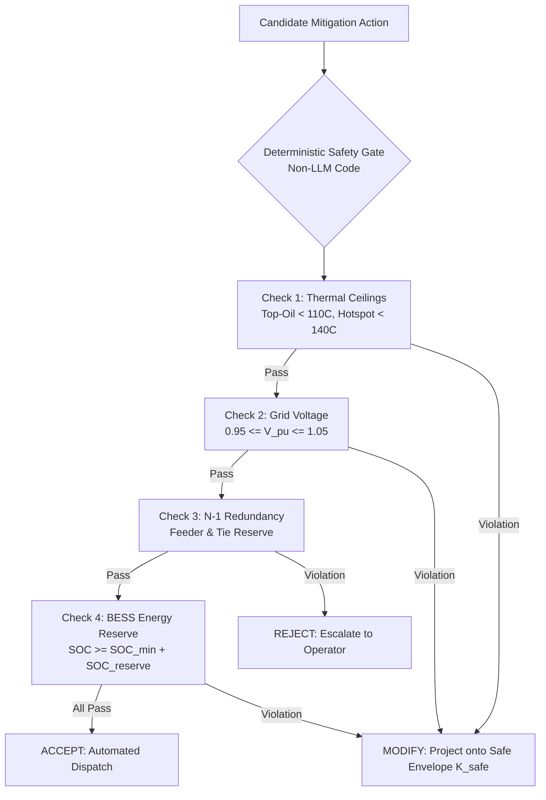

# ⚡ Thermal Sentinel Grid - Full Implementation Specification
> **FortyGuard Hackathon '26 - Track 06 (Agentic AI) & Track 02 (Future Buildings & Energy)**  
> Physics-Constrained Multi-Agent Decision-Support & Dispatch Engine for Distribution Transformers and Outdoor Energy Assets.

---

## 🧭 Core Architectural Philosophy

```
┌──────────────────────────────────────────────────────────────────────────────────────────────────────────┐
│                                   THE 3 ARCHITECTURAL PILLARS                                            │
│                                                                                                          │
│   1. External Boundary Condition  ──►  FortyGuard 2m Ambient Air + Persistence + Solar Irradiance        │
│   2. Physical State Estimation    ──►  IEEE C57.91 / IEC 60076-7 Differential Thermal & Aging Equations  │
│   3. Deterministic Safety Gate    ──►  Non-LLM Hard Enforcement (Voltage 0.95-1.05pu, N-1, Hotspot <140C)│
└──────────────────────────────────────────────────────────────────────────────────────────────────────────┘
```

> [!IMPORTANT]
> **Framing Rule:** The system is framed as a **physics-constrained decision-support and dispatch platform**, not as a system claiming to certify equipment loading or predict failure from ambient temperature alone. The LLM orchestrates tools and explains decisions; deterministic code enforces physical safety constraints.

---

## 1. 📐 Mathematical Formulation & Thermal Equations

### 1.1 Variables & Implementation Notation

| Symbol | Definition | Unit / Convention |
| :--- | :--- | :--- |
| $T_a(t)$ | FortyGuard 2-meter ambient air temperature at asset | ${}^\circ\mathrm{C}$ |
| $T_o(t)$ | Absolute top-oil temperature | ${}^\circ\mathrm{C}$ |
| $\theta_o(t)$ | Top-oil temperature rise above ambient ($T_o - T_a$) | ${}^\circ\mathrm{C}$ |
| $\theta_w(t)$ | Winding hot-spot rise over top oil | ${}^\circ\mathrm{C}$ |
| $T_{hs}(t)$ | Absolute winding hot-spot temperature | ${}^\circ\mathrm{C}$ (Kelvin for Arrhenius) |
| $K(t)$ | Per-unit load ratio ($I(t) / I_{\text{rated}}$) | dimensionless ($[0.0, 2.0]$) |
| $R$ | Ratio of load loss to no-load loss at rated load | dimensionless ($\approx 3.0 - 6.0$) |
| $\Delta\theta_{o,r}$ | Rated-load steady-state top-oil rise | ${}^\circ\mathrm{C}$ ($\approx 45 - 55^\circ\mathrm{C}$) |
| $\Delta\theta_{w,r}$ | Rated-load winding hot-spot gradient over top oil | ${}^\circ\mathrm{C}$ ($\approx 20 - 30^\circ\mathrm{C}$) |
| $n, m$ | Top-oil and winding thermal exponents | $n \approx 0.8 - 0.9$, $m \approx 0.8$ |
| $\tau_o, \tau_w$ | Top-oil and winding thermal time constants | $\tau_o \approx 1.5 - 3.0\text{ h}$, $\tau_w \approx 4 - 10\text{ min}$ |
| $S(t)$ | Solar irradiance from FortyGuard endpoint | $\mathrm{W/m^2}$ |

---

### 1.2 Top-Oil Transient Differential Equation (IEC 60076-7)

$$\tau_o \frac{d\theta_o(t)}{dt} + \theta_o(t) = \theta_{o,u}(K(t), S(t))$$

Where the load-dependent steady-state top-oil rise is:
$$\theta_{o,u}(K) = \Delta\theta_{o,r} \left(\frac{1 + R K^2}{1 + R}\right)^n$$

**Absolute Temperature Form (Production API):**
$$\tau_o \frac{dT_o}{dt} + T_o = T_{a,\text{eff}}(t) + \Delta\theta_{o,r} \left(\frac{1 + R K^2}{1 + R}\right)^n$$

---

### 1.3 Winding Hot-Spot Transient Equation

$$\tau_w \frac{d\theta_w(t)}{dt} + \theta_w(t) = \theta_{w,u}(K(t)) = \Delta\theta_{w,r} K(t)^{2m}$$

The absolute winding hot-spot temperature is:
$$T_{hs}(t) = T_{a,\text{eff}}(t) + \theta_o(t) + \theta_w(t)$$

---

### 1.4 Equivalent Solar Ambient Increment

Solar irradiance is mapped into an **equivalent ambient increment**:
$$\Delta T_{\text{solar}}(t) = \frac{\alpha_{\text{abs}} S(t) A_{\text{proj}} F_{\text{view}}}{h_{\text{eff}} A_{\text{surf}}}$$
$$T_{a,\text{eff}}(t) = T_a(t) + \Delta T_{\text{solar}}(t)$$

---

### 1.5 Exact Discrete-Time State Updates ($\Delta t = 5\text{ min}$)

For numerical stability and exact integration:
$$\theta_{o,k+1} = \theta_{o,u,k} + \left(\theta_{o,k} - \theta_{o,u,k}\right) e^{-\Delta t / \tau_o}$$
$$\theta_{w,k+1} = \theta_{w,u,k} + \left(\theta_{w,k} - \theta_{w,u,k}\right) e^{-\Delta t / \tau_w}$$
$$T_{hs,k} = T_{a,\text{eff},k} + \theta_{o,k} + \theta_{w,k}$$

---

### 1.6 Insulation Loss-of-Life & Aging Acceleration Factor

IEEE/IEC Arrhenius-style aging acceleration factor $V(T_{hs})$:
$$V(T_{hs}) = \exp\left[\frac{15000}{383} - \frac{15000}{T_{hs} + 273.15}\right]$$
*Where $383\text{ K} = 110^\circ\mathrm{C}$ reference hot-spot temperature ($V = 1.0$ at normal rated life).*

**Cumulative Equivalent Aging Hours ($L_{\text{eq}}$):**
$$L_{\text{eq}} = \sum_{k=0}^{N-1} V(T_{hs,k}) \Delta t_k \quad (\Delta t_k \text{ in hours})$$

---

## 2. ⚡ Proper Parameterization of FortyGuard Persistence & Exceedance

> [!CAUTION]
> **Core Modeling Rule:** Do NOT add persistence ($P_\theta$) or degree-hours ($H_\theta$) directly into physical time constants ($\tau_o, \tau_w$).  
> *Persistence and exceedance shape the forcing trajectory; $\tau_o$ and $\tau_w$ determine the physical response.*

### Event-Response Ratios & Thermal Soak Index
- **Top-Oil Response Ratio:** $\rho_o = 1 - e^{-P_\theta / \tau_o}$ (when $\rho_o \approx 1$, the transformer has spent enough time to reach steady-state thermal saturation).
- **Winding Response Ratio:** $\rho_w = 1 - e^{-P_\theta / \tau_w}$.
- **Thermal Soak Index ($\mathrm{TSI}_\theta$):**
  $$\mathrm{TSI}_\theta = \frac{P_\theta}{\tau_o} + \lambda \frac{H_\theta}{\tau_o \theta_{\text{scale}}}$$

---

## 3. 🌐 Open Data Sources & Asset Mapping

### 3.1 OpenStreetMap Overpass QL Queries (Phoenix Metro Bounding Box)
```text
Bounding Box: south=33.20, west=-112.40, north=33.90, east=-111.80
```

```overpass
[out:json][timeout:180];
(
  // Substations and Transformers
  nwr["power"="substation"](33.20,-112.40,33.90,-111.80);
  nwr["power"="transformer"](33.20,-112.40,33.90,-111.80);
  
  // Power Distribution Lines
  way["power"~"line|minor_line|cable"](33.20,-112.40,33.90,-111.80);
  
  // Commercial / Industrial / Health Footprints
  nwr["building"~"commercial|industrial|warehouse|retail|office|supermarket"](33.20,-112.40,33.90,-111.80);
  nwr["amenity"~"hospital|university|school"](33.20,-112.40,33.90,-111.80);
);
out center tags;
```

### 3.2 Open Datasets Index
1. **NREL End-Use Load Profiles (AWS Public Dataset):** 15-minute building-stock load curves across US climate zones.
2. **EIA Form 861 / 860 / 861M:** Utility sales, customer classes, and generator/BESS registries.
3. **FEMA National Risk Index (NRI):** Census-tract-level heatwave vulnerability and consequence weighting.
4. **Electrical Feeder Topology:** IEEE 13-node / 34-node test feeders or OpenDSS distribution models.

---

## 4. 🛡️ Deterministic Safety Gate Architecture



### 4.1 Hard Constraint Ceilings
- **Upper Bound Hot-Spot Ceiling:** $T_{hs}^{U}(t) < 140^\circ\mathrm{C}$
- **Upper Bound Top-Oil Ceiling:** $T_o^{U}(t) < 110^\circ\mathrm{C}$
- **Voltage Envelope:** $0.95 \le V_i^{\text{pu}} \le 1.05$ across all monitored buses.
- **BESS Operating Envelope:** $SOC_{k+1} \ge SOC_{\min} + SOC_{\text{reserve}}$ (e.g., $20\% + 10\% = 30\%$).

### 4.2 Constraint Projection Logic (`MODIFY`)
If requested loading $K_{\text{proposed}}$ violates thermal limits, the gate solves for safe maximum capacity $K_{\text{safe}}$:
$$K_{\text{safe}} = \max K \quad \text{s.t. } T_{hs}^{U}(K) \le T_{hs,\max}, \; T_o^{U}(K) \le T_{o,\max}, \; V_i(K) \in [0.95, 1.05]$$

---

## 5. ☀️ Historical Replay Demonstration: Phoenix, July 2023

```
                                  PHOENIX HEATWAVE REPLAY EPISODE
   ┌───────────────────────────────────┐     ┌───────────────────────────────────┐
   │ Episode Dates: July 24-26, 2023   │ ──► │ Target Asset: Urban Substation    │
   │ Historic Record: 31 days >= 110°F │     │ • 2x Oil-Immersed Transformers    │
   │ Peak Ambient: 119°F (48.3°C)      │     │ • 1x BESS Unit + Commercial Loads │
   └───────────────────────────────────┘     └─────────────────┬─────────────────┘
                                                               │
                                                               ▼
   ┌───────────────────────────────────┐     ┌───────────────────────────────────┐
   │ Baseline (Airport Weather / Static│ vs. │ Thermal Sentinel (FortyGuard 2m   │
   │ Seasonal Rating):                 │     │ 12h Forecast + Proactive Pre-Cool)│
   │ • Hot-spot exceeds 140°C ceiling  │     │ • Hot-spot capped at 122°C safe   │
   │ • Severe cumulative aging (V=8.7) │     │ • 74% reduction in loss-of-life   │
   │ • Emergency load tripping         │     │ • Zero voltage/N-1 violations     │
   └───────────────────────────────────┘     └───────────────────────────────────┘
```

---

## 6. 🤖 LangGraph StateGraph Architecture

### 6.1 State Schema (`src/models/state.py`)
```python
from datetime import datetime
from typing import TypedDict, List, Dict, Any, Optional

class ThermalSentinelState(TypedDict):
    timestamp: datetime
    asset_id: str
    location: Dict[str, float]  # {"lat": float, "lon": float}
    fortyguard_forecast: Dict[str, Any]  # 12h 2m temp, irradiance, wet bulb
    persistence_metrics: Dict[str, float]  # P_40, H_40, TSI
    asset_parameters: Dict[str, Any]  # rating, tau_o, tau_w, loss ratio
    load_forecast: List[float]  # 12h load profile
    thermal_trajectory: Dict[str, List[float]]  # T_o, T_hs over 12h
    aging_summary: Dict[str, float]  # V_max, L_eq
    safety_gate_result: Dict[str, Any]  # status: ACCEPT | MODIFY | REJECT
    mitigation_plan: Optional[Dict[str, Any]]
    operator_approval_required: bool
    audit_trail: List[Dict[str, Any]]
```

### 6.2 StateGraph Flow
```
[Ingest & Validate] ──► [FortyGuard 12h Forecast & Persistence Node]
                                    │
                                    ▼
[Asset & Grid Mapping Node] ──► [IEEE/IEC Physics Simulation Node]
                                    │
                                    ▼
[Insulation Aging Evaluator] ──► [Mitigation Planner Node]
                                    │
                                    ▼
                        [Deterministic Safety Gate]
                               ┌────┴────┐
                      (Pass)   │         │  (Violation)
                               ▼         ▼
                    [Approved Dispatch] [Project Safe K_safe]
                               │         │
                               └────┬────┘
                                    ▼
                    [Audit Logger & Webhook Dispatcher]
```
